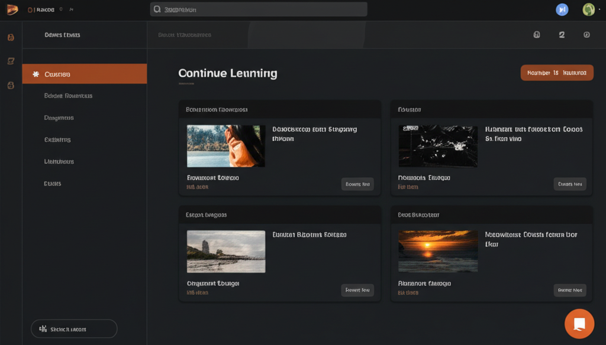
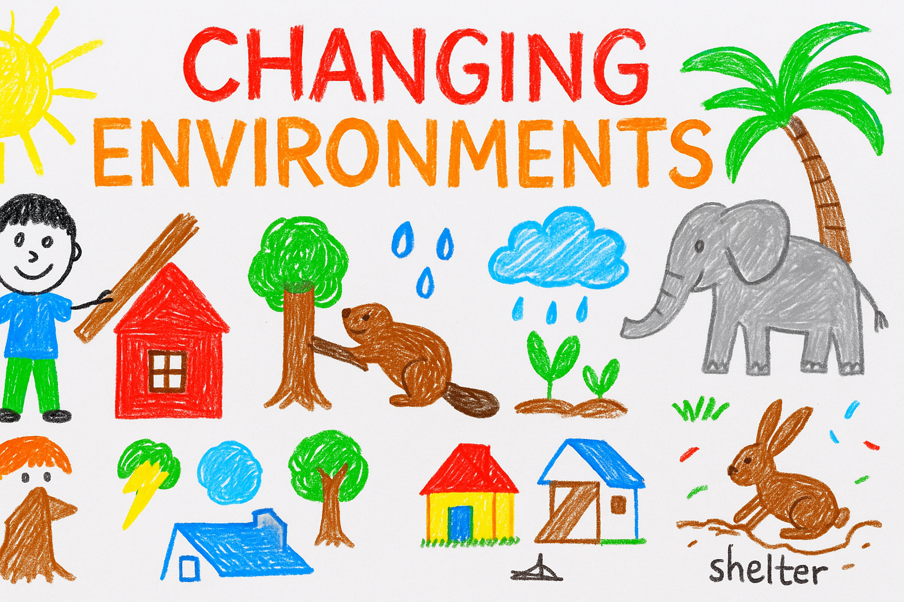

# 🎤 OECS Learning Hub - 10-Minute Presentation Script

---

## 🕒 Structure Overview

| Section | Duration | Focus |
|----------|-----------|--------|
| 1. Opening & Context | 1 min | Set the scene |
| 2. Product Overview | 2 min | What is OECS Learning Hub |
| 3. Key Features | 2 min | Core AI tools and benefits |
| 4. Architecture & Workflow | 2 min | How it works |
| 5. Impact & Use Cases | 2 min | Real-world examples |
| 6. Vision & Closing | 1 min | Future potential |

---

## 1️⃣ Opening & Context (1 min)

> **Slide Title:** Empowering Teachers with Offline AI

**Speaker Notes:**
- Begin by addressing the challenge: many Caribbean schools face inconsistent internet access.
- Introduce **OECS Learning Hub** as a privacy-first, offline solution for educators.
- Emphasize the regional focus: tailored for the **Organization of Eastern Caribbean States (OECS)**.

---

## 2️⃣ What is OECS Learning Hub? (2 min)

> **Slide Title:** AI-Powered Offline Educational Platform for Teachers

**Description:**
- A **desktop app** that allows teachers to generate curriculum-aligned educational resources using AI.
- Works **completely offline** — no data sharing, fully privacy-compliant.
- Designed specifically for **K–6+ Caribbean classrooms**.

**Target Audience:**
- K-12 teachers
- Multigrade educators (common in rural areas)
- Curriculum coordinators

**Visual Suggestion:**


---

## 3️⃣ Key Features (2 min)

> **Slide Title:** AI Tools for Teachers

### 🧠 AI-Powered Tools
- **PEARL Chat Assistant:** Context-aware conversational AI.
- **Lesson Planners:** Kindergarten, Standard, Multigrade, Cross-Curricular.
- **Quiz & Rubric Generators:** Create assessments and grading rubrics instantly.

### 📚 Resource Management
- Searchable history of all created materials.
- Export to Markdown and text files.
- Works 100% offline.

**Visual Suggestion:**


---

## 4️⃣ Architecture & Workflow (2 min)

> **Slide Title:** How It Works Behind the Scenes

**Technology Stack:**
- **Frontend:** React + TypeScript + TailwindCSS
- **Backend:** Python FastAPI
- **AI Engine:** Local Llama models (GGUF format)
- **Desktop Shell:** Electron

**Workflow:**
```
React UI (Frontend)
      ↓
Electron Shell
      ↓
FastAPI Backend
      ↓
Local Llama Model
      ↓
Content Generated & Saved Locally
```

**Speaker Notes:**
- Highlight “**Offline-First**”—no cloud servers.
- Emphasize privacy and efficiency.

**Visual Suggestion:**


---

## 5️⃣ Impact & Use Cases (2 min)

> **Slide Title:** Real Teachers, Real Impact

**Example 1: Lesson Planning**
- Ms. Johnson (Grade 3) generates a math lesson on fractions + quiz in under 20 minutes.

**Example 2: Multigrade Learning**
- Mrs. Baptiste uses one prompt to create differentiated lessons for Grades 4–6.

**Example 3: Assessment Development**
- Mr. Williams uses the quiz generator for a science unit test with rubric alignment.

**Impact Metrics:**
- Lesson prep time reduced by **50–70%**
- Increased curriculum alignment
- Support for under-resourced rural classrooms

---

## 6️⃣ Future Vision & Closing (1 min)

> **Slide Title:** Building the Future of Caribbean Education

**Roadmap:**
- Expand to support secondary curriculum.
- Add local language and cultural context.
- Continue improving model quality with regional datasets.

**Speaker Closing Notes:**
- *“OECS Learning Hub shows how AI can empower—not replace—teachers.”*  
- *“We’re building a future where every Caribbean classroom has access to AI-powered creativity.”*

---

## 🧾 Quick Recap (Summary Slide)

| Feature | Benefit |
|----------|----------|
| **Offline AI** | 100% privacy & reliability |
| **Curriculum-Aligned** | Direct match to OECS standards |
| **Teacher Tools** | Lesson, quiz, and rubric generation |
| **Cross-Platform** | Available on Windows, macOS, and Linux |
| **Community-Oriented** | Designed for Caribbean educators |

---

## ⏱️ Presentation Timing Summary

| Section | Time |
|----------|------|
| 1. Opening | 1:00 |
| 2. Overview | 2:00 |
| 3. Features | 2:00 |
| 4. Architecture | 2:00 |
| 5. Impact | 2:00 |
| 6. Closing | 1:00 |
| **Total** | **10:00 min** |

---

*OECS Learning Hub – Offline AI Innovation for Caribbean Classrooms*