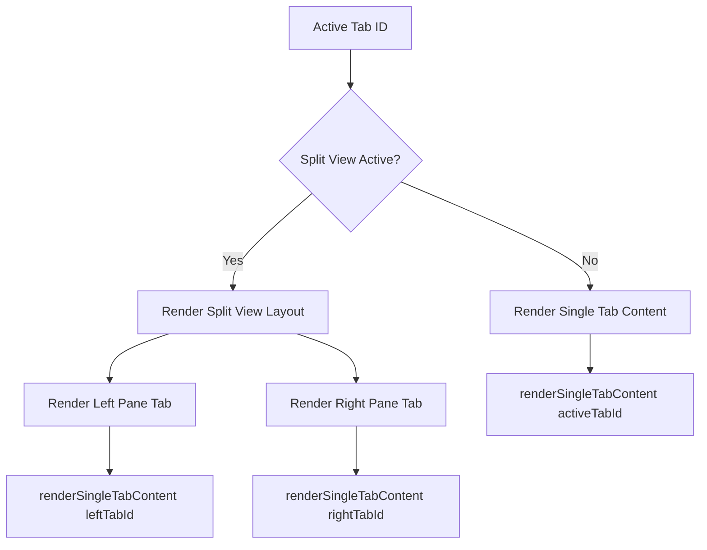
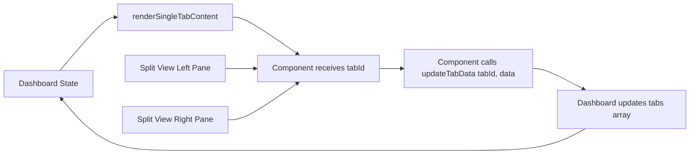

# Split View Architecture Design

## Executive Summary

This document outlines the architectural redesign of the split view functionality, transforming it from a separate tab object to a rendering mode. This aligns with VSCode's split editor pattern where splits are a view state rather than discrete entities.

---

## 1. Current Problems Analysis

### 1.1 Architectural Issues
- **Split as Tab Object**: Split views are created as separate [`Tab`](frontend/src/types/index.ts:16) objects with `type: 'split'`
- **Dedicated Tab Bar Entry**: Split tabs appear in the tab bar alongside regular tabs
- **Sync Issues**: Changes in split view don't properly sync because they reference tab IDs, but the split is a separate entity
- **Type Pollution**: `Tab.type` includes `'split'` which shouldn't be a tab type
- **Split-Specific Data**: `Tab.splitTabs?: [string, string]` property only used by split tabs

### 1.2 Code Locations
- **Split Creation**: [`createSplitTab()`](frontend/src/components/Dashboard.tsx:330-348) in Dashboard.tsx
- **Split Rendering**: [`renderTabContent()`](frontend/src/components/Dashboard.tsx:581-600) checks `tab.type === 'split'`
- **Split Closing**: [`closeTab()`](frontend/src/components/Dashboard.tsx:264-285) has special logic for split tabs
- **Tab Counting**: [`getTabCountByType()`](frontend/src/components/Dashboard.tsx:226-228) excludes split tabs

---

## 2. New Architecture Design

### 2.1 State Management Structure

#### 2.1.1 Split View State Interface
```typescript
// New interface to be added to frontend/src/types/index.ts
export interface SplitViewState {
  isActive: boolean;           // Whether split view is currently active
  leftTabId: string | null;    // Tab displayed in left pane
  rightTabId: string | null;   // Tab displayed in right pane
  activePaneId: 'left' | 'right'; // Which pane is currently focused
}
```

#### 2.1.2 Updated Tab Interface
```typescript
// Modified Tab interface - REMOVE splitTabs and 'split' from type
export interface Tab {
  id: string;
  title: string;
  type: 'chat' | 'lesson-planner' | 'rubric-generator' | 'curriculum' | 
        'quiz-generator' | 'multigrade-planner' | 'kindergarten-planner' | 
        'cross-curricular-planner' | 'analytics' | 'resource-manager' | 'settings';
  active: boolean;
  data?: any;
  // splitTabs property REMOVED
}
```

#### 2.1.3 Dashboard State Variables
```typescript
// In Dashboard component
const [tabs, setTabs] = useState<Tab[]>([]);
const [activeTabId, setActiveTabId] = useState<string | null>(null);

// NEW: Split view state (replaces split tabs in tabs array)
const [splitView, setSplitView] = useState<SplitViewState>({
  isActive: false,
  leftTabId: null,
  rightTabId: null,
  activePaneId: 'left'
});
```

### 2.2 State Storage Strategy

#### 2.2.1 LocalStorage Keys
```typescript
// Existing keys (unchanged)
'dashboard-tabs'         // Array of Tab objects (no more split tabs)
'dashboard-active-tab'   // Currently active tab ID

// NEW keys
'dashboard-split-view'   // SplitViewState object
```

#### 2.2.2 Persistence Logic
```typescript
// Save split view state whenever it changes
useEffect(() => {
  if (splitView.isActive) {
    localStorage.setItem('dashboard-split-view', JSON.stringify(splitView));
  } else {
    localStorage.removeItem('dashboard-split-view');
  }
}, [splitView]);

// Load split view state on mount
useEffect(() => {
  const savedSplitView = localStorage.getItem('dashboard-split-view');
  if (savedSplitView) {
    try {
      const parsed = JSON.parse(savedSplitView);
      // Validate that referenced tabs still exist
      const leftExists = tabs.find(t => t.id === parsed.leftTabId);
      const rightExists = tabs.find(t => t.id === parsed.rightTabId);
      
      if (leftExists && rightExists) {
        setSplitView(parsed);
      } else {
        localStorage.removeItem('dashboard-split-view');
      }
    } catch (error) {
      console.error('Error loading split view state:', error);
    }
  }
}, []);
```

---

## 3. Tab Rendering Logic

### 3.1 Content Rendering Flow



### 3.2 Modified renderTabContent Function

```typescript
const renderTabContent = () => {
  // Split view mode: render two tabs side-by-side
  if (splitView.isActive && splitView.leftTabId && splitView.rightTabId) {
    const leftTab = tabs.find(t => t.id === splitView.leftTabId);
    const rightTab = tabs.find(t => t.id === splitView.rightTabId);

    if (!leftTab || !rightTab) {
      // One of the tabs no longer exists, exit split mode
      setSplitView({ isActive: false, leftTabId: null, rightTabId: null, activePaneId: 'left' });
      return null;
    }

    return (
      <div className="flex h-full divide-x divide-gray-200">
        <div 
          className={`flex-1 overflow-hidden ${splitView.activePaneId === 'left' ? 'ring-2 ring-blue-500' : ''}`}
          onClick={() => setSplitView(prev => ({ ...prev, activePaneId: 'left' }))}
        >
          {renderSingleTabContent(leftTab)}
        </div>
        <div 
          className={`flex-1 overflow-hidden ${splitView.activePaneId === 'right' ? 'ring-2 ring-blue-500' : ''}`}
          onClick={() => setSplitView(prev => ({ ...prev, activePaneId: 'right' }))}
        >
          {renderSingleTabContent(rightTab)}
        </div>
      </div>
    );
  }

  // Normal mode: render active tab
  const activeTab = tabs.find(t => t.id === activeTabId);
  if (!activeTab) return null;
  
  return renderSingleTabContent(activeTab);
};
```

### 3.3 renderSingleTabContent Changes

**NO CHANGES REQUIRED** - This function already handles individual tab rendering and doesn't need to know about split view mode. It receives a [`Tab`](frontend/src/types/index.ts:16) object and renders the appropriate component.

---

## 4. UI/UX Changes

### 4.1 Tab Bar Modifications

#### 4.1.1 Visual Indicators
```typescript
// Tabs in split view should have visual indicator
const renderTabInTabBar = (tab: Tab) => {
  const isInSplitView = splitView.isActive && 
    (tab.id === splitView.leftTabId || tab.id === splitView.rightTabId);
  
  const paneIndicator = isInSplitView ? (
    <div className="absolute -top-1 -right-1 w-4 h-4 bg-blue-500 rounded-full flex items-center justify-center">
      <Columns className="w-2 h-2 text-white" />
    </div>
  ) : null;

  return (
    <div className={`relative ${isInSplitView ? 'border-blue-500' : ''}`}>
      {/* Tab content */}
      {paneIndicator}
    </div>
  );
};
```

#### 4.1.2 Split View Toggle Button
```typescript
// New button in top bar (next to "Close All Tabs")
<button
  onClick={toggleSplitView}
  disabled={tabs.length < 2}
  className={`p-2 rounded-lg transition group ml-2 flex-shrink-0 ${
    splitView.isActive 
      ? 'bg-blue-100 text-blue-600' 
      : 'hover:bg-gray-100 text-gray-600'
  }`}
  title={splitView.isActive ? 'Exit Split View' : 'Enter Split View'}
>
  <Columns className="w-5 h-5" />
</button>
```

### 4.2 User Interaction Flows

#### 4.2.1 Activating Split View
```typescript
const toggleSplitView = () => {
  if (splitView.isActive) {
    // Exit split view
    setSplitView({
      isActive: false,
      leftTabId: null,
      rightTabId: null,
      activePaneId: 'left'
    });
  } else {
    // Enter split view with last two active tabs
    const sortedTabs = [...tabs].sort((a, b) => {
      // Sort by recent activity (we'll need to track lastActiveTime)
      return (b.lastActiveTime || 0) - (a.lastActiveTime || 0);
    });
    
    if (sortedTabs.length >= 2) {
      setSplitView({
        isActive: true,
        leftTabId: sortedTabs[0].id,
        rightTabId: sortedTabs[1].id,
        activePaneId: 'left'
      });
    }
  }
};
```

#### 4.2.2 Clicking Tabs in Split View
```typescript
const handleTabClick = (tabId: string) => {
  if (!splitView.isActive) {
    // Normal mode: just activate the tab
    setActiveTabId(tabId);
  } else {
    // Split view mode: replace tab in active pane
    if (splitView.activePaneId === 'left') {
      setSplitView(prev => ({ ...prev, leftTabId: tabId }));
    } else {
      setSplitView(prev => ({ ...prev, rightTabId: tabId }));
    }
  }
};
```

#### 4.2.3 Closing Tabs in Split View
```typescript
const closeTab = (tabId: string) => {
  const updatedTabs = tabs.filter(tab => tab.id !== tabId);
  setTabs(updatedTabs);
  
  // If closing a tab that's in split view
  if (splitView.isActive && (tabId === splitView.leftTabId || tabId === splitView.rightTabId)) {
    if (updatedTabs.length < 2) {
      // Not enough tabs for split view, exit it
      setSplitView({
        isActive: false,
        leftTabId: null,
        rightTabId: null,
        activePaneId: 'left'
      });
      if (updatedTabs.length > 0) {
        setActiveTabId(updatedTabs[0].id);
      }
    } else {
      // Replace closed tab with another available tab
      const availableTab = updatedTabs.find(t => 
        t.id !== splitView.leftTabId && t.id !== splitView.rightTabId
      );
      
      if (availableTab) {
        if (tabId === splitView.leftTabId) {
          setSplitView(prev => ({ ...prev, leftTabId: availableTab.id }));
        } else {
          setSplitView(prev => ({ ...prev, rightTabId: availableTab.id }));
        }
      }
    }
  } else {
    // Normal tab close behavior
    if (activeTabId === tabId && updatedTabs.length > 0) {
      setActiveTabId(updatedTabs[updatedTabs.length - 1].id);
    }
  }
};
```

### 4.3 Context Menu Updates

The right-click context menu should be updated to support the new split view mode:

```typescript
// Remove old "Split with..." menu
// Add new split view options:
- "Open in Left Pane" (if split view is active)
- "Open in Right Pane" (if split view is active)
- "Split View with This Tab" (creates split view with clicked tab + current active)
```

---

## 5. Data Flow and Synchronization

### 5.1 Component Data Props Flow



### 5.2 Key Principle: tabId-Based Updates

**Critical**: All components receive `tabId` and use it to update their data:

```typescript
// Component example (e.g., LessonPlanner)
interface LessonPlannerProps {
  tabId: string;  // The actual tab ID
  savedData: any;
  onDataChange: (data: any) => void;
}

// When component updates data:
onDataChange(newFormData);  // This calls updateTabData(tabId, newFormData)
```

**This means**: Whether the component is rendered in split view or normal view, it's always updating the same `Tab` object in the `tabs` array. There's no synchronization needed because both panes reference the same underlying data.

### 5.3 Active Tab Tracking

```typescript
// Need to track last active time for smart split view defaults
interface Tab {
  id: string;
  title: string;
  type: /* ... */;
  active: boolean;
  data?: any;
  lastActiveTime?: number;  // NEW: timestamp of last activation
}

// Update on tab activation
const handleTabClick = (tabId: string) => {
  setTabs(prev => prev.map(tab => ({
    ...tab,
    lastActiveTime: tab.id === tabId ? Date.now() : tab.lastActiveTime
  })));
  // ... rest of logic
};
```

---

## 6. Backward Compatibility

### 6.1 Migration Strategy for Existing Split Tabs

```typescript
// On app load, check for old split tabs and convert them
const migrateLegacySplitTabs = (savedTabs: Tab[]) => {
  const splitTabs = savedTabs.filter(t => t.type === 'split');
  const regularTabs = savedTabs.filter(t => t.type !== 'split');
  
  if (splitTabs.length > 0) {
    // Take the first split tab found
    const firstSplit = splitTabs[0];
    
    if (firstSplit.splitTabs && firstSplit.splitTabs.length === 2) {
      const [leftId, rightId] = firstSplit.splitTabs;
      
      // Check if both referenced tabs exist
      const leftExists = regularTabs.find(t => t.id === leftId);
      const rightExists = regularTabs.find(t => t.id === rightId);
      
      if (leftExists && rightExists) {
        // Convert to new split view state
        setSplitView({
          isActive: true,
          leftTabId: leftId,
          rightTabId: rightId,
          activePaneId: 'left'
        });
        
        // Save new format
        localStorage.setItem('dashboard-split-view', JSON.stringify({
          isActive: true,
          leftTabId: leftId,
          rightTabId: rightId,
          activePaneId: 'left'
        }));
      }
    }
    
    // Return only regular tabs (split tabs are removed)
    return regularTabs;
  }
  
  return savedTabs;
};

// Use in initial load effect
useEffect(() => {
  const savedTabs = localStorage.getItem('dashboard-tabs');
  if (savedTabs) {
    try {
      const parsedTabs = JSON.parse(savedTabs);
      const migratedTabs = migrateLegacySplitTabs(parsedTabs);
      setTabs(migratedTabs);
      // ... rest of loading logic
    } catch (error) {
      console.error('Error loading saved tabs:', error);
    }
  }
}, []);
```

### 6.2 Type Safety Updates

```typescript
// Update Tool type to remove 'split' (it's not a tool type)
export interface Tool {
  id: string;
  name: string;
  icon: string;
  type: 'chat' | 'lesson-planner' | 'rubric-generator' | 'curriculum' | 
        'quiz-generator' | 'multigrade-planner' | 'kindergarten-planner' | 
        'cross-curricular-planner' | 'analytics' | 'resource-manager' | 'settings';
  description: string;
  group?: string;
}
```

---

## 7. Implementation Roadmap

### Phase 1: Type Updates and State Setup (Low Risk)
1. ✅ Add `SplitViewState` interface to [`types/index.ts`](frontend/src/types/index.ts:1)
2. ✅ Update [`Tab`](frontend/src/types/index.ts:16) interface (remove `splitTabs`, remove `'split'` from type union)
3. ✅ Update [`Tool`](frontend/src/types/index.ts:25) interface (remove `'split'` from type union)
4. ✅ Add `lastActiveTime?: number` to [`Tab`](frontend/src/types/index.ts:16) interface
5. ✅ Add `splitView` state variable to [`Dashboard`](frontend/src/components/Dashboard.tsx:153) component
6. ✅ Add split view persistence logic (save/load)

### Phase 2: Migration Logic (Medium Risk)
1. ✅ Implement `migrateLegacySplitTabs()` function
2. ✅ Add migration logic to initial load effect
3. ✅ Test with existing saved tabs containing split tabs
4. ✅ Verify old split tabs are properly converted

### Phase 3: Rendering Logic (Medium Risk)
1. ✅ Update [`renderTabContent()`](frontend/src/components/Dashboard.tsx:581) to check `splitView.isActive` instead of `tab.type === 'split'`
2. ✅ Implement split view rendering with left/right panes
3. ✅ Add active pane indication (visual focus indicator)
4. ✅ Test that components render correctly in both modes
5. ✅ Verify data updates work in both panes

### Phase 4: UI Controls (Medium Risk)
1. ✅ Add split view toggle button to top bar
2. ✅ Add visual indicators to tabs in split view
3. ✅ Update context menu (remove old split options)
4. ✅ Add keyboard shortcut support (optional)
5. ✅ Test user interactions and edge cases

### Phase 5: Tab Management (High Risk)
1. ✅ Update [`handleTabClick()`](frontend/src/components/Dashboard.tsx:1093) for split view mode
2. ✅ Update [`closeTab()`](frontend/src/components/Dashboard.tsx:264) to handle split view tabs
3. ✅ Implement smart tab replacement in split view
4. ✅ Add last active time tracking
5. ✅ Test tab switching, closing, and edge cases

### Phase 6: Cleanup (Low Risk)
1. ✅ Remove [`createSplitTab()`](frontend/src/components/Dashboard.tsx:330) function
2. ✅ Remove split-specific logic from [`getTabCountByType()`](frontend/src/components/Dashboard.tsx:226)
3. ✅ Remove split colors from `tabColors` generation
4. ✅ Update [`groupedTabs`](frontend/src/components/Dashboard.tsx:602) logic to exclude split type
5. ✅ Clean up unused code and comments

### Phase 7: Testing and Polish
1. ⬜ Comprehensive testing of all scenarios
2. ⬜ Performance testing (ensure no regressions)
3. ⬜ Accessibility testing
4. ⬜ Documentation updates
5. ⬜ User feedback and refinements

---

## 8. Benefits of New Architecture

### 8.1 Architectural Benefits
- ✅ **Separation of Concerns**: Split view is rendering logic, not data
- ✅ **Data Integrity**: Single source of truth for tab data
- ✅ **Type Safety**: No more special `'split'` type pollution
- ✅ **Maintainability**: Simpler state management
- ✅ **Scalability**: Easy to extend (e.g., 3-way split in future)

### 8.2 User Experience Benefits
- ✅ **Automatic Sync**: Changes in split view instantly reflect in tab
- ✅ **Persistence**: Split view state saves across sessions
- ✅ **Intuitive**: Matches VSCode's familiar split editor behavior
- ✅ **Flexible**: Easy to switch tabs in/out of split view
- ✅ **Clean UI**: No fake "split" tabs cluttering the tab bar

### 8.3 Developer Experience Benefits
- ✅ **No Special Cases**: Components don't need to know about split view
- ✅ **Simpler Logic**: No sync mechanisms needed
- ✅ **Better Types**: TypeScript can properly validate tab types
- ✅ **Easier Testing**: Split view is just a rendering mode

---

## 9. Edge Cases and Considerations

### 9.1 Edge Case Handling

| Scenario | Current Behavior | New Behavior |
|----------|-----------------|--------------|
| Close tab in split view | Split tab remains, shows "tab not found" | Auto-replace with available tab or exit split |
| Only 1 tab open | Can't create split | Split button disabled |
| Close all tabs | Split tab also closes | Split state resets |
| Duplicate tab types | Creates new split tab | Just switches view mode |
| Save/Load with split | Saves split as tab | Saves split as view state |

### 9.2 Future Enhancements

Potential features enabled by this architecture:
- **Triple Split**: Add `middleTabId` to `SplitViewState`
- **Vertical/Horizontal Split**: Add `orientation: 'horizontal' | 'vertical'`
- **Split Presets**: Save common split configurations
- **Drag-and-Drop**: Drag tabs to panes to change split
- **Swap Panes**: Quick button to swap left/right tabs
- **Independent Scrolling**: Each pane has its own scroll state

---

## 10. Testing Checklist

### 10.1 Unit Tests
- [ ] `SplitViewState` persistence and loading
- [ ] Tab migration from old format
- [ ] Tab click behavior in split vs normal mode
- [ ] Tab close behavior in various scenarios
- [ ] Split view activation/deactivation

### 10.2 Integration Tests
- [ ] Component data updates in split view
- [ ] Multiple components in split view simultaneously
- [ ] Split view state persists across page refresh
- [ ] Migration from old split tabs works correctly
- [ ] Tab switching maintains correct state

### 10.3 E2E Tests
- [ ] Full user workflow: activate split, edit both panes, close split
- [ ] Close tab in split view, verify auto-replacement
- [ ] Open app with saved split state
- [ ] Migrate from old version with split tabs
- [ ] All tab types work correctly in split view

---

## 11. Performance Considerations

### 11.1 Rendering Optimization
```typescript
// Both panes should memoize independently
const LeftPane = React.memo(({ tab }: { tab: Tab }) => {
  return renderSingleTabContent(tab);
});

const RightPane = React.memo(({ tab }: { tab: Tab }) => {
  return renderSingleTabContent(tab);
});
```

### 11.2 State Update Optimization
```typescript
// Use functional updates to avoid unnecessary re-renders
const updateSplitViewPane = (pane: 'left' | 'right', tabId: string) => {
  setSplitView(prev => {
    if (pane === 'left' && prev.leftTabId === tabId) return prev;
    if (pane === 'right' && prev.rightTabId === tabId) return prev;
    
    return {
      ...prev,
      [pane === 'left' ? 'leftTabId' : 'rightTabId']: tabId
    };
  });
};
```

---

## 12. Summary

This architecture transforms split view from a **tab object** to a **rendering mode**, providing:

1. **Better Data Model**: Split state is separate from tab data
2. **Automatic Sync**: Both panes reference the same underlying tab
3. **Cleaner UI**: No fake split tabs in the tab bar
4. **VSCode-like UX**: Familiar and intuitive split behavior
5. **Future-Proof**: Easy to extend with more features

The implementation can be done incrementally with minimal risk, and backward compatibility is maintained through automatic migration of old split tabs.
