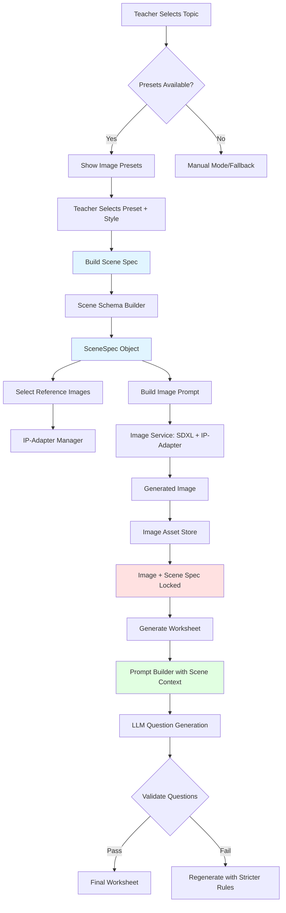

# Implementation Roadmap - Image-First Worksheet System

## Quick Start Guide (Priority Order)

### 🚀 Week 1: Foundation (Configuration Layer)

**Day 1-2: Create Configuration Files**

```bash
# Create directory structure
mkdir -p backend/config
mkdir -p backend/config/reference_images/{line_art_references,cartoon_3d_references,illustrated_references,realistic_references}

# Create core config files
touch backend/config/topic_presets.json
touch backend/config/style_profiles.json
touch backend/config/reference_images_index.json
```

**Files to create:**

1. [`backend/config/topic_presets.json`](../backend/config/topic_presets.json) - Start with 5 topics
2. [`backend/config/style_profiles.json`](../backend/config/style_profiles.json) - 4 styles
3. [`backend/config/reference_images_index.json`](../backend/config/reference_images_index.json) - Empty to start

**Validation:** Load configs successfully in Python

---

**Day 3-4: Scene Schema System**

Files to create:

1. [`backend/scene_schema.py`](../backend/scene_schema.py) - Core schema classes
2. [`frontend/src/types/scene.ts`](../frontend/src/types/scene.ts) - TypeScript types

**Test:** Build a scene spec from a preset programmatically

---

**Day 5-7: Reference Image Manager**

Files to create:

1. [`backend/ip_adapter_manager.py`](../backend/ip_adapter_manager.py) - Reference loader
2. Curate 5 reference images per style (20 total)

**Test:** Load references for a style profile

---

### 🎨 Week 2: Image Generation Pipeline

**Day 8-10: Update Image Service**

Modify:

1. [`backend/image_service.py`](../backend/image_service.py) - Add `generate_image_from_scene()`
2. Add IP-Adapter integration (if available)

**Test:** Generate image from scene spec + style profile

---

**Day 11-12: Image Asset Store**

Create:

1. [`backend/image_asset_store.py`](../backend/image_asset_store.py) - Persistent storage
2. `backend/data/image_assets/` directory

**Test:** Store and retrieve images with metadata

---

**Day 13-14: Backend API Endpoints**

Modify [`backend/main.py`](../backend/main.py):

- `GET /api/topic-presets`
- `GET /api/topic-presets/{topic_id}`
- `POST /api/generate-scene-image`
- `GET /api/image-assets/{asset_id}`

**Test:** Hit endpoints with curl/Postman

---

### 🖼️ Week 3: Frontend Integration

**Day 15-17: Update Worksheet Generator UI**

Modify [`frontend/src/components/WorksheetGenerator.tsx`](../frontend/src/components/WorksheetGenerator.tsx):

- Add preset selector (replace free-form prompt)
- Add style profile dropdown
- Store scene spec with image
- Update image generation handler

**Test:** Select preset → generate image → view in UI

---

**Day 18-20: Update Prompt Builder**

Modify [`frontend/src/utils/worksheetPromptBuilder.ts`](../frontend/src/utils/worksheetPromptBuilder.ts):

- Add `buildSceneContextPrompt()` function
- Pass scene spec to LLM
- Add hallucination prevention rules

**Test:** Generate worksheet with scene-aware questions

---

**Day 21: End-to-End Testing**

Run complete workflow:

1. Select Science > Grade 4 > Solar System
2. Choose "Solar System Overview" preset
3. Select "Cartoon 3D" style
4. Generate image
5. Generate worksheet
6. Validate questions only reference scene objects

---

## Architecture Flow Diagram



## Data Flow

```
User Input (Topic)
    ↓
Topic Preset Lookup
    ↓
Scene Specification (Structured Objects + Relationships)
    ↓
┌─────────────────┐
│ Image Generator │
├─────────────────┤
│ • Preset Prompt │
│ • Style Profile │
│ • IP-Adapter    │
└─────────────────┘
    ↓
Generated Image + Scene Spec (Locked)
    ↓
┌──────────────────────┐
│ Worksheet Generator  │
├──────────────────────┤
│ Questions Generated  │
│ FROM Scene Spec      │
│ NOT from Pixels      │
└──────────────────────┘
    ↓
Final Worksheet (Image + Questions)
```

## File Tree (After Implementation)

```
backend/
  config/
    topic_presets.json          ✨ NEW
    style_profiles.json         ✨ NEW
    reference_images_index.json ✨ NEW
    reference_images/           ✨ NEW
      line_art_references/
      cartoon_3d_references/
      illustrated_references/
      realistic_references/
  data/
    image_assets/               ✨ NEW
      index.json
      asset_*.png
  scene_schema.py               ✨ NEW
  ip_adapter_manager.py         ✨ NEW
  image_asset_store.py          ✨ NEW
  image_service.py              📝 MODIFIED
  main.py                       📝 MODIFIED

frontend/
  src/
    types/
      scene.ts                  ✨ NEW
    components/
      WorksheetGenerator.tsx    📝 MODIFIED
    utils/
      worksheetPromptBuilder.ts 📝 MODIFIED
```

## Key Design Principles (Checklist)

Before you start coding, verify your understanding:

- [ ] **Presets, Not Prompts** - Teachers select from curated options
- [ ] **Image First** - Generate/select image BEFORE worksheet
- [ ] **Scene Spec = Source of Truth** - Structured metadata, not pixels
- [ ] **No Hallucination** - Questions only reference scene spec objects
- [ ] **Reusable Assets** - Same image = multiple worksheets
- [ ] **Style Consistency** - IP-Adapter references stabilize output
- [ ] **Grade Appropriate** - Style profiles match developmental levels

## Common Pitfalls to Avoid

1. ❌ **Don't:** Let teachers freestyle image prompts by default
   ✅ **Do:** Provide 3-5 curated presets per topic

2. ❌ **Don't:** Generate questions from looking at the image
   ✅ **Do:** Generate questions from the scene spec metadata

3. ❌ **Don't:** Create new images for every worksheet
   ✅ **Do:** Reuse images across multiple worksheet variants

4. ❌ **Don't:** Mix image generation and worksheet generation
   ✅ **Do:** Separate image creation (with scene spec) from question creation

5. ❌ **Don't:** Allow questions about things not in the scene spec
   ✅ **Do:** Validate questions against scene spec before showing to user

## Testing Strategy

### Unit Tests

```python
# backend/tests/test_scene_schema.py
def test_build_scene_from_preset():
    builder = SceneSchemaBuilder()
    scene = builder.build_scene_from_preset(
        topic_id="science.grade4.solar_system",
        preset_id="solar_system_overview",
        style_profile_id="cartoon_3d"
    )
    assert len(scene.objects) > 0
    assert scene.topic_id == "science.grade4.solar_system"
```

### Integration Tests

```python
# backend/tests/test_image_workflow.py
def test_end_to_end_image_generation():
    # 1. Build scene spec
    scene_spec = build_scene(...)

    # 2. Generate image
    image = generate_from_scene(scene_spec, style)

    # 3. Store asset
    asset_id = store.store_image(image, scene_spec, ...)

    # 4. Retrieve asset
    retrieved = store.get_asset(asset_id)
    assert retrieved["scene_spec"] == scene_spec.dict()
```

### Validation Tests

```typescript
// frontend/tests/questionValidation.test.ts
test("questions only reference scene objects", () => {
  const sceneSpec = {
    objects: [
      { id: "sun_01", name: "Sun", visible: true },
      { id: "earth_01", name: "Earth", visible: true },
    ],
    exclusions: ["moons", "asteroids"],
  };

  const questions = [
    "How many planets are shown?", // ✓ Valid
    "What is the moon's phase?", // ✗ Invalid - moon is excluded
  ];

  const validation = validateQuestions(questions, sceneSpec);
  expect(validation.invalid).toContain(1);
});
```

## Minimum Viable Implementation (MVP)

To test the concept quickly, implement this subset:

**MVP Scope:**

1. ✅ 1 subject (Science)
2. ✅ 1 grade (Grade 4)
3. ✅ 1 topic (Solar System)
4. ✅ 2 presets (Overview, Inner Planets)
5. ✅ 2 styles (Cartoon 3D, Line Art)
6. ✅ 5 reference images total
7. ✅ 1 complete workflow test

**MVP Files (Minimum):**

- `backend/config/topic_presets.json` (1 topic)
- `backend/config/style_profiles.json` (2 styles)
- `backend/scene_schema.py`
- `frontend/src/types/scene.ts`
- Modified `WorksheetGenerator.tsx` (preset selector only)

**Success Criteria for MVP:**

- [ ] Can select "Solar System Overview" preset
- [ ] Can choose "Cartoon 3D" style
- [ ] Image generated with scene spec
- [ ] Worksheet generated with scene-aware prompts
- [ ] Questions don't hallucinate excluded items

## Reference Resources

- **SDXL Turbo docs:** https://huggingface.co/stabilityai/sdxl-turbo
- **IP-Adapter:** https://github.com/tencent-ailab/IP-Adapter
- **Pydantic validation:** https://docs.pydantic.dev/
- **Scene graph concepts:** https://en.wikipedia.org/wiki/Scene_graph

## Questions to Answer During Implementation

1. **IP-Adapter Integration:** Does your current `image_service.py` support IP-Adapter? If not, can it be added?
2. **Reference Images:** Where will you source initial reference images? Generate them or curate from existing?
3. **Preset Coverage:** Which topics are most commonly taught? Start there.
4. **Style Preferences:** Survey teachers on preferred visual styles
5. **Storage Strategy:** Local filesystem OK for MVP? Or need cloud storage?

---

## Ready to Start?

**Recommended first task:**

```bash
# Create the config directory and first preset file
mkdir -p backend/config
code backend/config/topic_presets.json
```

Start with ONE topic you know well (e.g., solar system), define 3 presets, and test the scene spec generation manually.

Would you like me to generate starter content for any specific config file?
