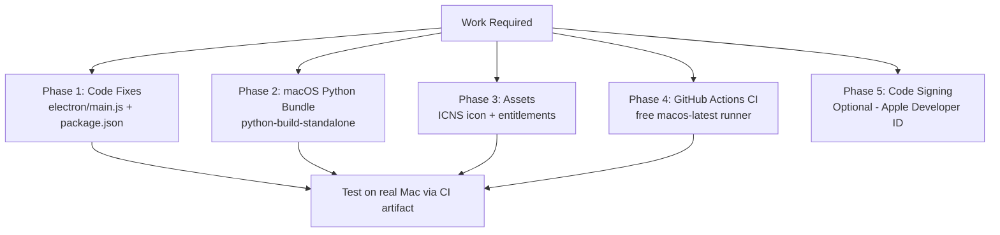

# macOS Deployment Plan — OECS Teacher Assistant

> **Goal:** Package and distribute the OECS Teacher Assistant Electron app for macOS (both Apple Silicon and Intel) without requiring a Mac for the build process, using GitHub Actions as a free macOS CI runner.

---

## Overview

The application is already 100% cross-platform at the **logic layer** — the React frontend, Python backend, and Electron IPC all run natively on macOS. The work is entirely in the **build pipeline and a small number of platform-specific code paths** in `electron/main.js`.



---

## Phase 1 — Fix Windows-Specific Code in `electron/main.js`

These are the three specific changes needed in the existing Electron main process:

### 1a. Platform-Aware Python Executable (`electron/main.js` line 94)

**Current (Windows-only):**

```js
const bundledPythonPath = path.join(
  process.resourcesPath,
  "backend-bundle",
  "python-embed",
  "python.exe",
);
```

**Fix — detect platform:**

```js
const pythonBin = process.platform === "win32" ? "python.exe" : "python3";
const bundledPythonPath = path.join(
  process.resourcesPath,
  "backend-bundle",
  "python-embed",
  pythonBin,
);
```

Also applies to the dev-mode path at line 115:

```js
// Current
const devPythonPath = path.join(
  __dirname,
  "..",
  "backend",
  "python-embed",
  "python.exe",
);

// Fix
const devPythonBin = process.platform === "win32" ? "python.exe" : "python3";
const devPythonPath = path.join(
  __dirname,
  "..",
  "backend",
  "python-embed",
  devPythonBin,
);
```

### 1b. PATH Separator (`electron/main.js` line 302)

**Current (Windows semicolon separator):**

```js
env.PATH = `${gtkBinPath};${env.PATH}`;
```

**Fix:**

```js
const pathSep = process.platform === "win32" ? ";" : ":";
env.PATH = `${gtkBinPath}${pathSep}${env.PATH}`;
```

### 1c. WeasyPrint / GTK on macOS

On Windows, WeasyPrint relies on GTK DLLs bundled in `backend-bundle/bin`. On macOS, WeasyPrint uses system libraries installed via Homebrew or bundled differently. Options:

- **Option A (Recommended):** Install WeasyPrint dependencies into the bundled Python virtual environment using `pip` — no GTK DLLs needed on macOS since it uses native Cairo/Pango
- **Option B:** Wrap the GTK PATH injection in a Windows guard:

```js
if (process.platform === "win32") {
  const gtkBinPath = path.join(process.resourcesPath, "backend-bundle", "bin");
  env.PATH = `${gtkBinPath};${env.PATH}`;
  env.FONTCONFIG_PATH = path.join(
    process.resourcesPath,
    "backend-bundle",
    "etc",
    "fonts",
  );
}
```

### 1d. `windowsHide` option (line 330)

```js
backendProcess = spawn(pythonCmd, args, {
  cwd: backendPath,
  env: env,
  stdio: ["ignore", "pipe", "pipe"],
  windowsHide: true, // ← harmless on macOS, no change needed
});
```

No action required — `windowsHide` is silently ignored on non-Windows platforms.

---

## Phase 2 — macOS Python Bundle

### The Problem

The current setup uses **Windows Embeddable Python** (`python-embed/python.exe`) — a Windows-only distribution that does not exist on macOS.

### The Solution: `python-build-standalone`

Use [Gregory Szorc's python-build-standalone](https://github.com/indygreg/python-build-standalone/releases) — self-contained Python binaries for every platform, no system Python required.

Download targets:
| macOS Target | Download Filename Pattern |
|---|---|
| Apple Silicon (M1/M2/M3) | `cpython-3.11.*-aarch64-apple-darwin-*` |
| Intel Mac | `cpython-3.11.*-x86_64-apple-darwin-*` |

### Bundle Structure on macOS

```
backend-bundle/
├── python-embed/
│   ├── python3          ← from python-build-standalone (no .exe)
│   ├── lib/
│   │   └── python3.11/  ← stdlib
│   └── ...
├── main.py
├── config.py
├── start_backend.py
└── ... (other backend .py files)
```

### How to Build the macOS Python Bundle

Create a new script `build-scripts/package-backend-mac.sh`:

```bash
#!/bin/bash
# Downloads python-build-standalone for macOS and installs backend dependencies

PYTHON_VERSION="3.11.9"
ARCH=$(uname -m)  # arm64 or x86_64

if [ "$ARCH" = "arm64" ]; then
  PYTHON_URL="https://github.com/indygreg/python-build-standalone/releases/download/.../cpython-${PYTHON_VERSION}-aarch64-apple-darwin-install_only.tar.gz"
else
  PYTHON_URL="https://github.com/indygreg/python-build-standalone/releases/download/.../cpython-${PYTHON_VERSION}-x86_64-apple-darwin-install_only.tar.gz"
fi

# Download and extract
curl -L "$PYTHON_URL" -o python-standalone.tar.gz
tar -xzf python-standalone.tar.gz -C backend-bundle/python-embed --strip-components=1

# Install backend dependencies into bundled Python
backend-bundle/python-embed/bin/pip3 install -r backend/requirements.txt
```

> **Note:** You will source the exact release URL from the [python-build-standalone releases page](https://github.com/indygreg/python-build-standalone/releases) when implementing this phase. Pin to a specific release tag for reproducible builds.

---

## Phase 3 — macOS Assets

### 3a. App Icon — `.icns` File

macOS requires an `.icns` icon file (Windows uses `.ico`). These are different formats.

**How to create `build/OECS.icns` from the existing icon:**

Option A — On a Mac:

```bash
mkdir OECS.iconset
# Copy resized versions of the icon into the iconset folder at required sizes:
# icon_16x16.png, icon_32x32.png, icon_64x64.png, icon_128x128.png,
# icon_256x256.png, icon_512x512.png, icon_512x512@2x.png
iconutil -c icns OECS.iconset -o build/OECS.icns
```

Option B — Online converter (no Mac needed): Use [CloudConvert](https://cloudconvert.com/png-to-icns) or [iConvert Icons](https://iconverticons.com/) to convert your existing PNG/ICO to `.icns`. Place the output at `build/OECS.icns`.

### 3b. Entitlements File

macOS requires an entitlements `.plist` file for sandboxed features. Create `build/entitlements.mac.plist`:

```xml
<?xml version="1.0" encoding="UTF-8"?>
<!DOCTYPE plist PUBLIC "-//Apple//DTD PLIST 1.0//EN" "http://www.apple.com/DTDs/PropertyList-1.0.dtd">
<plist version="1.0">
<dict>
  <key>com.apple.security.cs.allow-jit</key>
  <true/>
  <key>com.apple.security.cs.allow-unsigned-executable-memory</key>
  <true/>
  <key>com.apple.security.cs.disable-library-validation</key>
  <true/>
  <key>com.apple.security.network.client</key>
  <true/>
  <key>com.apple.security.network.server</key>
  <true/>
  <key>com.apple.security.files.user-selected.read-write</key>
  <true/>
</dict>
</plist>
```

> The `allow-unsigned-executable-memory` and `disable-library-validation` entitlements are required because the app spawns a Python subprocess and loads native `.node` modules.

---

## Phase 4 — Add macOS Target to `electron-builder` (`package.json`)

### Current `package.json` build config (Windows only):

```json
"win": {
  "icon": "build/OECS.ico",
  "target": ["nsis"]
}
```

### Add `mac` block:

```json
"mac": {
  "icon": "build/OECS.icns",
  "target": [
    { "target": "dmg", "arch": ["arm64", "x64"] },
    { "target": "zip", "arch": ["arm64", "x64"] }
  ],
  "category": "public.app-category.education",
  "hardenedRuntime": true,
  "gatekeeperAssess": false,
  "entitlements": "build/entitlements.mac.plist",
  "entitlementsInherit": "build/entitlements.mac.plist"
},
"dmg": {
  "title": "OECS Teacher Assistant",
  "internetEnabled": false
}
```

> **Note on `hardenedRuntime: true`:** Required for notarization. The entitlements above relax the restrictions that would otherwise prevent Python subprocess spawning.

### Add macOS build scripts to `package.json`:

```json
"electron:build:mac": "npm run build && electron-builder --mac",
"electron:build:mac:arm64": "npm run build && electron-builder --mac --arm64",
"electron:build:mac:x64": "npm run build && electron-builder --mac --x64"
```

---

## Phase 5 — GitHub Actions CI (Free macOS Runner)

This is the key piece — build the macOS package **without owning a Mac**, using GitHub's free `macos-latest` runner (Apple Silicon, M1).

Create `.github/workflows/build-mac.yml`:

```yaml
name: Build macOS

on:
  workflow_dispatch: # Run manually from GitHub UI
  push:
    tags:
      - "v*" # Also run on version tags (e.g., v2.1.0)

jobs:
  build-mac:
    runs-on: macos-latest # Free Apple Silicon (M1) runner

    steps:
      - name: Checkout code
        uses: actions/checkout@v4

      - name: Setup Node.js
        uses: actions/setup-node@v4
        with:
          node-version: "20"
          cache: "npm"

      - name: Setup Python
        uses: actions/setup-python@v5
        with:
          python-version: "3.11"

      - name: Install Node dependencies
        run: npm install

      - name: Install Python backend dependencies
        run: |
          cd backend
          python3 -m venv venv
          source venv/bin/activate
          pip install -r requirements.txt

      - name: Download python-build-standalone for macOS arm64
        run: |
          chmod +x build-scripts/package-backend-mac.sh
          ./build-scripts/package-backend-mac.sh

      - name: Build frontend
        run: npm run build:frontend

      - name: Build Electron app for macOS
        run: npm run electron:build:mac
        env:
          GH_TOKEN: ${{ secrets.GITHUB_TOKEN }}
          # For code signing (optional - see Phase 6)
          # CSC_LINK: ${{ secrets.APPLE_CERT_BASE64 }}
          # CSC_KEY_PASSWORD: ${{ secrets.APPLE_CERT_PASSWORD }}
          # APPLE_ID: ${{ secrets.APPLE_ID }}
          # APPLE_APP_SPECIFIC_PASSWORD: ${{ secrets.APPLE_APP_SPECIFIC_PASSWORD }}
          # APPLE_TEAM_ID: ${{ secrets.APPLE_TEAM_ID }}

      - name: Upload macOS artifacts
        uses: actions/upload-artifact@v4
        with:
          name: macos-build
          path: |
            dist-electron/*.dmg
            dist-electron/*.zip
          retention-days: 14 # Keep artifacts for 14 days for download/testing
```

### How to Trigger a Build

1. Push code to GitHub
2. Go to **Actions** tab in your repo → **Build macOS** workflow
3. Click **Run workflow**
4. Wait ~10-15 minutes
5. Download the `.dmg` from the **Artifacts** section of the completed run
6. Send the `.dmg` to anyone with a Mac for testing

---

## Phase 6 — Code Signing & Notarization (Optional, for Distribution)

> **Skip this phase for personal testing.** Only needed if distributing to other people's Macs publicly (they would otherwise see a Gatekeeper warning).

### Requirements

- Apple Developer Program membership (~$99/year USD)
- A Mac to generate the signing certificate (one-time setup)

### Setup Steps

1. Enroll at [developer.apple.com](https://developer.apple.com/programs/)
2. Create a **Developer ID Application** certificate in Xcode or the Apple Developer portal
3. Export the certificate as a `.p12` file
4. Base64-encode it: `base64 -i certificate.p12 | pbcopy`
5. Add the following **GitHub Secrets** to your repo:
   - `APPLE_CERT_BASE64` — the base64-encoded `.p12`
   - `APPLE_CERT_PASSWORD` — the `.p12` export password
   - `APPLE_ID` — your Apple ID email
   - `APPLE_APP_SPECIFIC_PASSWORD` — App-specific password from [appleid.apple.com](https://appleid.apple.com)
   - `APPLE_TEAM_ID` — your 10-character Team ID from the Developer portal
6. Uncomment the signing env vars in the GitHub Actions workflow (Phase 5)

### What Notarization Does

- Apple scans the app for malware
- Staples a notarization ticket to the `.dmg`
- Users can install without any Gatekeeper warning

---

## Phase 7 — macOS-Compatible Build Script

Create `build-release-mac.sh` as the macOS equivalent of `build-release.ps1`:

```bash
#!/bin/bash
set -e

echo "=== Building OECS Teacher Assistant (macOS) ==="

# Step 1: Package Python backend
echo "[1/5] Packaging Python backend for macOS..."
chmod +x build-scripts/package-backend-mac.sh
./build-scripts/package-backend-mac.sh

# Step 2: Check models
echo "[2/5] Checking for LLaMA models..."
if [ ! -d "models" ] || [ -z "$(ls models/*.gguf 2>/dev/null)" ]; then
  echo "ERROR: No .gguf model files found in models/"
  exit 1
fi
echo "Found model files:"
ls -lh models/*.gguf

# Step 3: Build frontend
echo "[3/5] Building frontend..."
npm run build:frontend

# Step 4: Build Electron app
echo "[4/5] Building Electron macOS app..."
npm run electron:build:mac

# Step 5: Output
echo "[5/5] Build complete!"
echo "Output in: dist-electron/"
ls dist-electron/*.dmg 2>/dev/null && echo "DMG ready for distribution."
```

---

## Summary of All Files to Create or Modify

| File                                      | Action     | What Changes                                                                            |
| ----------------------------------------- | ---------- | --------------------------------------------------------------------------------------- |
| [`electron/main.js`](../electron/main.js) | **Modify** | `getPythonPath()` — platform-aware exe name; PATH separator fix; GTK Windows guard      |
| [`package.json`](../package.json)         | **Modify** | Add `mac` electron-builder target; add mac build scripts; fix dev `backend` script path |
| `build/OECS.icns`                         | **Create** | macOS app icon (convert from existing PNG/ICO)                                          |
| `build/entitlements.mac.plist`            | **Create** | Required macOS entitlements for Python subprocess + native modules                      |
| `build-scripts/package-backend-mac.sh`    | **Create** | Downloads python-build-standalone for macOS, installs pip dependencies                  |
| `.github/workflows/build-mac.yml`         | **Create** | GitHub Actions CI — builds on free `macos-latest` runner                                |
| `build-release-mac.sh`                    | **Create** | macOS equivalent of `build-release.ps1`                                                 |

---

## Key Decisions to Make Before Implementation

1. **Architecture target:** `arm64` only, `x64` only, or Universal binary (`arm64 + x64`)?
   - Universal binary is safest for compatibility but roughly doubles build time and output size
   - Recommendation: Start with `arm64` (Apple Silicon) — covers all Macs sold since late 2020

2. **WeasyPrint on macOS:** Test if PDF generation works with the bundled Python's pip-installed WeasyPrint before adding system dependency handling.

3. **Code signing now or later?** For internal testing, unsigned works fine. Add signing when ready for external distribution.
