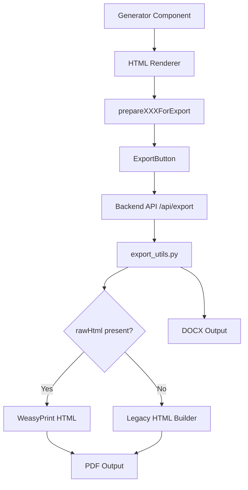

# PDF Export Architecture Analysis

## Executive Summary

This document provides a deep technical investigation into the PDF export mechanisms across all generators in the OECS Learning Hub application. The Quiz Generator serves as the gold standard for pixel-accurate (WYSIWYG) PDF exports. This analysis identifies the architectural patterns, differences, and gaps across all generators.

---

## 1. Export Pipeline Overview

### 1.1 High-Level Architecture



### 1.2 Key Files in Export Pipeline

| Layer              | File               | Purpose                                      |
| ------------------ | ------------------ | -------------------------------------------- |
| Frontend Component | `ExportButton.tsx` | Unified export UI and API caller             |
| Frontend Renderer  | `*HtmlRenderer.ts` | Generate styled HTML for each generator type |
| Backend API        | `main.py`          | `/api/export` endpoint                       |
| Backend Logic      | `export_utils.py`  | PDF/DOCX generation via WeasyPrint           |

---

## 2. Quiz Generator - Gold Standard Analysis

### 2.1 Rendering Strategy

**File**: [`frontend/src/utils/quizHtmlRenderer.ts`](frontend/src/utils/quizHtmlRenderer.ts:1)

The Quiz Generator uses a **complete HTML document generation** approach:

1. **Phase 1: Parsing** - Parses AI-generated text into structured `ParsedQuiz` format
2. **Phase 2: HTML Generation** - Generates complete HTML document with inline styles
3. **Phase 3: Export Preparation** - Returns object with `rawHtml`, `content`, `formData`, `accentColor`

### 2.2 Styling Source of Truth

```typescript
// Complete HTML document with embedded styles
const fullHTML = `
<!DOCTYPE html>
<html>
<head>
  <meta charset="UTF-8">
  <style>
    @page {
      size: A4;
      margin: 1.5cm;
    }
    body {
      font-family: 'Segoe UI', -apple-system, BlinkMacSystemFont, sans-serif;
      line-height: 1.6;
      color: #374151;
    }
  </style>
</head>
<body>
  <!-- Header with gradient background -->
  <!-- Content sections -->
  <!-- Footer -->
</body>
</html>`;
```

**Key Styling Characteristics**:

- All styles are **inline** (`style` attributes)
- CSS `@page` rule controls pagination
- Font stack specified for cross-platform consistency
- Accent color injected dynamically via template strings

### 2.3 Pagination Logic

```css
@page {
  size: A4;
  margin: 1.5cm;
}
```

- Fixed A4 page size
- 1.5cm margins on all sides
- WeasyPrint handles automatic page breaks

### 2.4 Font Handling

- **Primary**: `'Segoe UI'` (Windows native)
- **Fallbacks**: `-apple-system, BlinkMacSystemFont, sans-serif`
- All fonts are system fonts (no custom font embedding required)

### 2.5 Asset Handling

- No external images in Quiz export
- Icons rendered as CSS-only elements (divs with borders/backgrounds)
- Self-contained HTML (no external dependencies)

### 2.6 Visual Editor Integration

**File**: [`frontend/src/components/QuizEditor.tsx`](frontend/src/components/QuizEditor.tsx:1)

- Structured editing with `ParsedQuiz` data model
- Teacher/Student version toggle
- Real-time preview matches export output
- Export respects `showAnswerKey`, `showExplanations`, `boldCorrectAnswers` options

---

## 3. Generator-by-Generator Comparison

### 3.1 Quiz Generator ✅ (Gold Standard)

| Aspect                    | Implementation           | Status      |
| ------------------------- | ------------------------ | ----------- |
| HTML Renderer             | `quizHtmlRenderer.ts`    | ✅ Complete |
| Export Function           | `prepareQuizForExport()` | ✅ Complete |
| rawHtml Generation        | Full HTML document       | ✅ Complete |
| @page CSS                 | A4, 1.5cm margins        | ✅ Present  |
| Visual Editor             | `QuizEditor.tsx`         | ✅ Complete |
| Teacher/Student Versions  | Supported                | ✅ Complete |
| Export Button Integration | `dataType="quiz"`        | ✅ Complete |

### 3.2 Worksheet Generator ✅

**File**: [`frontend/src/utils/worksheetHtmlRenderer.ts`](frontend/src/utils/worksheetHtmlRenderer.ts:1)

| Aspect                    | Implementation                | Status      |
| ------------------------- | ----------------------------- | ----------- |
| HTML Renderer             | `worksheetHtmlRenderer.ts`    | ✅ Complete |
| Export Function           | `prepareWorksheetForExport()` | ✅ Complete |
| rawHtml Generation        | Full HTML document            | ✅ Complete |
| @page CSS                 | A4, 1.5cm margins             | ✅ Present  |
| Template Support          | Multiple templates            | ✅ Complete |
| Image Support             | Generated images included     | ✅ Complete |
| Export Button Integration | `dataType="worksheet"`        | ✅ Complete |

**Template-Specific HTML Generators**:

- `generateMultipleChoiceHTML()`
- `generateComprehensionHTML()`
- `generateMatchingHTML()`
- `generateListBasedHTML()`

### 3.3 Lesson Planner ✅

**File**: [`frontend/src/utils/lessonHtmlRenderer.ts`](frontend/src/utils/lessonHtmlRenderer.ts:1)

| Aspect                    | Implementation             | Status      |
| ------------------------- | -------------------------- | ----------- |
| HTML Renderer             | `lessonHtmlRenderer.ts`    | ✅ Complete |
| Export Function           | `prepareLessonForExport()` | ✅ Complete |
| rawHtml Generation        | Full HTML document         | ✅ Complete |
| @page CSS                 | A4, 1.5cm margins          | ✅ Present  |
| Curriculum References     | Included in export         | ✅ Complete |
| Export Button Integration | `dataType="plan"`          | ✅ Complete |

### 3.4 Rubric Generator ✅

**File**: [`frontend/src/utils/rubricHtmlRenderer.ts`](frontend/src/utils/rubricHtmlRenderer.ts:1)

| Aspect                    | Implementation                  | Status      |
| ------------------------- | ------------------------------- | ----------- |
| HTML Renderer             | `rubricHtmlRenderer.ts`         | ✅ Complete |
| Export Function           | `prepareRubricForExport()`      | ✅ Complete |
| rawHtml Generation        | Full HTML document              | ✅ Complete |
| @page CSS                 | **A4 landscape**, 1.5cm margins | ✅ Present  |
| Table Rendering           | HTML table with styling         | ✅ Complete |
| Export Button Integration | `dataType="rubric"`             | ✅ Complete |

**Note**: Uses `size: A4 landscape` for wide rubric tables.

### 3.5 Multigrade Planner ✅

**File**: [`frontend/src/utils/multigradeHtmlRenderer.ts`](frontend/src/utils/multigradeHtmlRenderer.ts:1)

| Aspect                    | Implementation                 | Status                    |
| ------------------------- | ------------------------------ | ------------------------- |
| HTML Renderer             | `multigradeHtmlRenderer.ts`    | ✅ Complete               |
| Export Function           | `prepareMultigradeForExport()` | ✅ Complete               |
| rawHtml Generation        | Full HTML document             | ✅ Complete               |
| @page CSS                 | A4, 1.5cm margins              | ✅ Present                |
| Export Button Integration | `dataType="multigrade"`        | ⚠️ Uses `dataType="plan"` |

### 3.6 Kindergarten Planner ⚠️ (INCONSISTENT)

**File**: [`frontend/src/utils/kindergartenHtmlRenderer.ts`](frontend/src/utils/kindergartenHtmlRenderer.ts:1)

| Aspect                    | Implementation                   | Status                              |
| ------------------------- | -------------------------------- | ----------------------------------- |
| HTML Renderer             | `kindergartenHtmlRenderer.ts`    | ✅ Exists but **UNUSED**            |
| Export Function           | `prepareKindergartenForExport()` | ✅ Exists but **UNUSED**            |
| Export Button Integration | `dataType="plan"`                | ❌ **WRONG** - uses lesson renderer |

**CRITICAL ISSUE**:
In [`KindergartenPlanner.tsx:869`](frontend/src/components/KindergartenPlanner.tsx:869):

```typescript
<ExportButton
  dataType="plan"  // ❌ Should be "kindergarten"
  data={{
    content: generatedPlan,
    formData: formData,
    accentColor: tabColor
  }}
/>
```

The KindergartenPlanner incorrectly uses `dataType="plan"`, which routes to `lessonHtmlRenderer` instead of `kindergartenHtmlRenderer`. This causes:

- Incorrect header layout (lesson plan style vs kindergarten style)
- Missing kindergarten-specific metadata (ageGroup, week, dayOfWeek)
- Different visual styling

### 3.7 Cross-Curricular Planner ❌ (MISSING)

**File**: [`frontend/src/components/CrossCurricularPlanner.tsx`](frontend/src/components/CrossCurricularPlanner.tsx:894)

| Aspect                    | Implementation    | Status                              |
| ------------------------- | ----------------- | ----------------------------------- |
| HTML Renderer             | None exists       | ❌ **MISSING**                      |
| Export Function           | None exists       | ❌ **MISSING**                      |
| Export Button Integration | `dataType="plan"` | ❌ **WRONG** - uses lesson renderer |

**CRITICAL ISSUE**:
In [`CrossCurricularPlanner.tsx:894`](frontend/src/components/CrossCurricularPlanner.tsx:894):

```typescript
<ExportButton
  dataType="plan"  // ❌ No dedicated renderer exists
  data={{
    content: parsedPlan ? crossCurricularPlanToDisplayText(parsedPlan) : generatedPlan,
    formData: formData,
    accentColor: tabColor
  }}
/>
```

Cross-Curricular Planner:

- Has NO dedicated HTML renderer (`crossCurricularHtmlRenderer.ts` does not exist)
- Uses `dataType="plan"` which routes to `lessonHtmlRenderer`
- Export output does not match the editor's visual structure
- Missing cross-curricular specific features:
  - Integration model display
  - Multiple subject objectives
  - Cross-curricular activities section
  - Subject connection mapping

---

## 4. Export Button Routing Analysis

### 4.1 Current Routing Logic

**File**: [`frontend/src/components/ExportButton.tsx`](frontend/src/components/ExportButton.tsx:40)

```typescript
if (dataType === 'worksheet') {
  exportData = prepareWorksheetForExport(...);
} else if (dataType === 'plan') {
  exportData = prepareLessonForExport(...);  // Used by Lesson, Kindergarten, Cross-Curricular
} else if (dataType === 'rubric') {
  exportData = prepareRubricForExport(...);
} else if (dataType === 'multigrade') {
  exportData = prepareMultigradeForExport(...);
} else {
  // quiz
  exportData = prepareQuizForExport(...);
}
```

### 4.2 Routing Table

| Generator        | dataType Used | Actual Renderer         | Correct Renderer              | Status             |
| ---------------- | ------------- | ----------------------- | ----------------------------- | ------------------ |
| Quiz             | `quiz`        | `quizHtmlRenderer`      | `quizHtmlRenderer`            | ✅ Correct         |
| Worksheet        | `worksheet`   | `worksheetHtmlRenderer` | `worksheetHtmlRenderer`       | ✅ Correct         |
| Lesson Plan      | `plan`        | `lessonHtmlRenderer`    | `lessonHtmlRenderer`          | ✅ Correct         |
| Rubric           | `rubric`      | `rubricHtmlRenderer`    | `rubricHtmlRenderer`          | ✅ Correct         |
| Multigrade       | `plan` ❌     | `lessonHtmlRenderer`    | `multigradeHtmlRenderer`      | ⚠️ Wrong type      |
| Kindergarten     | `plan` ❌     | `lessonHtmlRenderer`    | `kindergartenHtmlRenderer`    | ❌ Wrong renderer  |
| Cross-Curricular | `plan` ❌     | `lessonHtmlRenderer`    | `crossCurricularHtmlRenderer` | ❌ Missing + wrong |

---

## 5. Backend Export Processing

### 5.1 API Endpoint

**File**: [`backend/main.py:2076`](backend/main.py:2076)

```python
@app.post("/api/export")
async def export_data(
    data_type: str = Body(..., embed=True),
    format: str = Body(..., embed=True),
    data: dict = Body(..., embed=True),
    title: str = Body("Export", embed=True)
):
```

### 5.2 PDF Generation Flow

**File**: [`backend/export_utils.py:153`](backend/export_utils.py:153)

```python
def export_to_pdf(data: Union[str, Dict, List], title: str = "Export") -> bytes:
    from weasyprint import HTML

    # ✅ PRIORITY: Use rawHtml if provided (perfect consistency)
    if isinstance(data, dict) and data.get("rawHtml"):
        html = data["rawHtml"]
        pdf_bytes = HTML(string=html).write_pdf()
        return pdf_bytes

    # Fallback to legacy HTML generation
    ...
```

### 5.3 DOCX Generation Flow

**File**: [`backend/export_utils.py:229`](backend/export_utils.py:229)

```python
def export_to_docx_from_html(html: str, accent_color: str, form_data: dict) -> bytes:
    """Convert HTML to DOCX while preserving formatting."""
    doc = Document()
    soup = BeautifulSoup(html, 'html.parser')
    # Parse HTML elements and create DOCX equivalents
```

### 5.4 Key Technical Details

| Aspect        | Implementation            |
| ------------- | ------------------------- |
| PDF Engine    | WeasyPrint                |
| HTML Parsing  | BeautifulSoup4            |
| DOCX Engine   | python-docx               |
| Page Size     | Controlled by `@page` CSS |
| Font Handling | System fonts only         |

---

## 6. Visual Drift Analysis

### 6.1 Root Causes of Visual Drift

| Generator        | Drift Cause                                          | Severity   |
| ---------------- | ---------------------------------------------------- | ---------- |
| Kindergarten     | Uses wrong renderer (lesson instead of kindergarten) | **High**   |
| Cross-Curricular | Uses wrong renderer + no dedicated renderer          | **High**   |
| Multigrade       | Uses wrong dataType but correct renderer             | **Medium** |

### 6.2 Specific Drift Areas

#### Kindergarten Planner Drift

| Element          | Editor Display                          | PDF Export                        | Status      |
| ---------------- | --------------------------------------- | --------------------------------- | ----------- |
| Header           | Gradient with ageGroup, week, dayOfWeek | Lesson plan style header          | ❌ Mismatch |
| Metadata         | Age group, Week/Day, Duration, Students | Grade, Strand, Duration, Students | ❌ Mismatch |
| Activity Styling | Special activity highlighting           | Standard bullet points            | ❌ Mismatch |

#### Cross-Curricular Planner Drift

| Element            | Editor Display             | PDF Export             | Status      |
| ------------------ | -------------------------- | ---------------------- | ----------- |
| Header             | Integration model badge    | Standard lesson header | ❌ Mismatch |
| Subject Objectives | Multiple subject cards     | Flat bullet list       | ❌ Mismatch |
| Activities         | Structured activity blocks | Plain paragraphs       | ❌ Mismatch |
| Connections        | Visual connection mapping  | Not present            | ❌ Missing  |

---

## 7. Recommendations

### 7.1 Immediate Fixes (High Priority)

#### Fix 1: Kindergarten Planner Export

**File**: [`frontend/src/components/KindergartenPlanner.tsx:869`](frontend/src/components/KindergartenPlanner.tsx:869)

```typescript
// ❌ CURRENT (WRONG)
<ExportButton
  dataType="plan"
  data={{
    content: generatedPlan,
    formData: formData,
    accentColor: tabColor
  }}
/>

// ✅ CORRECT
<ExportButton
  dataType="kindergarten"
  data={{
    content: generatedPlan,
    formData: formData,
    accentColor: tabColor
  }}
/>
```

**File**: [`frontend/src/components/ExportButton.tsx:12`](frontend/src/components/ExportButton.tsx:12)

Add `kindergarten` handling:

```typescript
} else if (dataType === 'kindergarten') {
  exportData = prepareKindergartenForExport(
    data.content,
    data.formData,
    data.accentColor
  );
}
```

#### Fix 2: Create Cross-Curricular HTML Renderer

Create new file: `frontend/src/utils/crossCurricularHtmlRenderer.ts`

Required features:

- Integration model badge in header
- Multiple subject objectives grid
- Cross-curricular activity blocks
- Connection visualization
- Subject-specific styling

#### Fix 3: Cross-Curricular Planner Export

**File**: [`frontend/src/components/CrossCurricularPlanner.tsx:894`](frontend/src/components/CrossCurricularPlanner.tsx:894)

```typescript
// ❌ CURRENT (WRONG)
<ExportButton
  dataType="plan"
  ...
/>

// ✅ CORRECT
<ExportButton
  dataType="cross-curricular"
  data={{
    content: generatedPlan,
    parsedPlan: parsedPlan,
    formData: formData,
    accentColor: tabColor
  }}
/>
```

#### Fix 4: Multigrade Planner Export Type

**File**: [`frontend/src/components/MultigradePlanner.tsx:698`](frontend/src/components/MultigradePlanner.tsx:698)

```typescript
// ❌ CURRENT
<ExportButton
  dataType="plan"
  ...
/>

// ✅ CORRECT
<ExportButton
  dataType="multigrade"
  ...
/>
```

### 7.2 Architecture Improvements (Medium Priority)

#### Recommendation 1: Unified HTML Renderer Interface

All HTML renderers should implement a common interface:

```typescript
interface HtmlRenderer<TFormData, TContent> {
  generateHTML(content: TContent, options: RenderOptions<TFormData>): string;
  prepareForExport(
    content: TContent,
    formData: TFormData,
    accentColor: string,
  ): ExportData;
}
```

#### Recommendation 2: Export Button Auto-Routing

Instead of manual if-else chain, use a registry pattern:

```typescript
const exportRenderers: Record<string, ExportRenderer> = {
  quiz: { prepare: prepareQuizForExport },
  worksheet: { prepare: prepareWorksheetForExport },
  plan: { prepare: prepareLessonForExport },
  rubric: { prepare: prepareRubricForExport },
  multigrade: { prepare: prepareMultigradeForExport },
  kindergarten: { prepare: prepareKindergartenForExport },
  "cross-curricular": { prepare: prepareCrossCurricularForExport },
};
```

#### Recommendation 3: Shared Header Component

Create a reusable header component for consistency:

```typescript
interface ExportHeaderProps {
  title: string;
  subtitle?: string;
  badge?: string;
  metadata: Array<{ label: string; value: string }>;
  accentColor: string;
}
```

### 7.3 Quality Assurance (Low Priority)

1. **Visual Regression Testing**: Compare PDF outputs against editor screenshots
2. **Export Preview**: Add "Preview Export" mode before downloading
3. **Style Linting**: Validate all HTML renderers follow style guidelines

---

## 8. Appendix: Code Reference

### 8.1 Complete Export Data Flow

```
User Clicks Export
    ↓
ExportButton.handleExport()
    ↓
prepareXXXForExport() → { rawHtml, content, formData, accentColor }
    ↓
axios.post('/api/export', { data_type, format, data, title })
    ↓
Backend: export_data() endpoint
    ↓
EXPORT_FORMATTERS[format](data, title)
    ↓
export_to_pdf() or export_to_docx()
    ↓
WeasyPrint HTML → PDF or python-docx → DOCX
    ↓
Download File
```

### 8.2 HTML Renderer Checklist

For new or updated HTML renderers, ensure:

- [ ] Complete HTML5 document structure (`<!DOCTYPE html>`)
- [ ] `@page` CSS rule with appropriate size and margins
- [ ] System font stack specified
- [ ] All styles are inline (no external CSS)
- [ ] Dynamic accent color support
- [ ] Header with gradient background
- [ ] Metadata display section
- [ ] Content section matching editor structure
- [ ] Footer with generation timestamp
- [ ] No external dependencies (images, fonts)

### 8.3 Backend Export Type Registry

**File**: [`backend/main.py:2040`](backend/main.py:2040)

```python
EXPORT_TYPE_FORMATS = {
    "quiz": ["pdf", "docx"],
    "plan": ["pdf", "docx"],
    "rubric": ["pdf", "docx"],
    "kindergarten": ["pdf", "docx"],
    "multigrade": ["pdf", "docx"],
    "cross-curricular": ["pdf", "docx"],
    "worksheet": ["pdf", "docx"],
}
```

---

## 9. Summary

### 9.1 Current State

| Generator        | Has Renderer | Uses Correctly | Visual Fidelity  |
| ---------------- | ------------ | -------------- | ---------------- |
| Quiz             | ✅           | ✅             | ✅ Gold Standard |
| Worksheet        | ✅           | ✅             | ✅ Good          |
| Lesson Plan      | ✅           | ✅             | ✅ Good          |
| Rubric           | ✅           | ✅             | ✅ Good          |
| Multigrade       | ✅           | ⚠️ Wrong type  | ⚠️ Drifted       |
| Kindergarten     | ✅           | ❌ Wrong       | ❌ Drifted       |
| Cross-Curricular | ❌           | ❌ Wrong       | ❌ Drifted       |

### 9.2 Required Actions

1. **KindergartenPlanner.tsx**: Change `dataType="plan"` to `dataType="kindergarten"`
2. **ExportButton.tsx**: Add `kindergarten` case handling
3. **Create**: `crossCurricularHtmlRenderer.ts` with full implementation
4. **CrossCurricularPlanner.tsx**: Change `dataType="plan"` to `dataType="cross-curricular"`
5. **ExportButton.tsx**: Add `cross-curricular` case handling
6. **MultigradePlanner.tsx**: Change `dataType="plan"` to `dataType="multigrade"`
7. **Backend**: Add `cross-curricular` to `EXPORT_TYPE_FORMATS`

### 9.3 Effort Estimate

| Task                             | Effort  | Priority |
| -------------------------------- | ------- | -------- |
| Fix Kindergarten export          | 30 min  | High     |
| Create Cross-Curricular renderer | 4 hours | High     |
| Fix Cross-Curricular export      | 30 min  | High     |
| Fix Multigrade export type       | 15 min  | Medium   |
| Unified renderer interface       | 2 hours | Low      |
| Visual regression testing        | 4 hours | Low      |

---

_Document generated: 2026-02-03_
_Analysis scope: Frontend and Backend export architecture_
_Gold standard reference: Quiz Generator_
