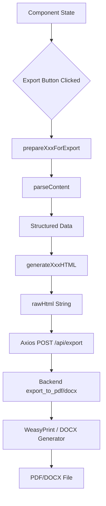

# PDF Export Improvements: Analysis & Implementation Plan

## Executive Summary

The quiz generator's PDF export is "perfect" because it achieves **true WYSIWYG** (What You See Is What You Get) through a synchronized dual-rendering system. This document reveals a critical architecture issue: **each generator has TWO separate formatting code paths** (Preview JSX vs Export HTML) that can drift out of sync. The quiz generator works well because both paths use the same structured data approach. This document analyzes the pattern and provides a definitive solution for all generators.

### The Core Problem

```
Current Architecture (Problematic):
┌─────────────────┐     ┌──────────────────┐
│   AI Content    │────→│  formatXxxText() │──→ JSX Preview
└─────────────────┘     └──────────────────┘
         │
         ↓
┌─────────────────┐     ┌──────────────────┐
│  parseContent() │────→│ generateXxxHTML()│──→ HTML Export
└─────────────────┘     └──────────────────┘
```

**Two separate code paths = Visual inconsistency risk**

### The Solution

**Option A (Recommended)**: Single Source of Truth

- Use HTML renderer for both preview and export
- Preview uses `dangerouslySetInnerHTML` with the HTML output
- Export uses the same HTML output

**Option B**: Synchronized Rendering

- Keep JSX for preview, HTML for export
- Both use IDENTICAL structured data and styling logic
- Any change requires updating both files

---

## The Dual-Rendering Architecture Issue

Every generator has **two separate formatting functions**:

| Function            | Purpose          | Output             | Location                                      |
| ------------------- | ---------------- | ------------------ | --------------------------------------------- |
| `formatXxxText()`   | Preview display  | JSX/React elements | Component file (e.g., QuizGenerator.tsx)      |
| `generateXxxHTML()` | Export rendering | HTML string        | HtmlRenderer file (e.g., quizHtmlRenderer.ts) |

### Why Quiz Generator Works Well

The quiz generator maintains visual consistency because:

1. **Both functions use the same structured data** (`ParsedQuiz`)
2. **Both apply similar styling logic** (accent colors, conditional rendering)
3. **Both respect export options** (teacher/student toggle)

### Why Others May Fail

Other generators may have inconsistencies because:

1. **Preview uses line-by-line text parsing** while **export uses different parsing**
2. **Styles differ between JSX (Tailwind) and HTML (inline styles)**
3. **Export doesn't account for all preview features**
4. **Changes to preview aren't reflected in export**

---

## What Makes Quiz Generator's Export "Perfect"

### Key Pattern: Structured Data → HTML → PDF

```
AI Text Content
      ↓
[parseQuizContent()] → Structured Data (ParsedQuiz)
      ↓
[generateQuizHTML()] → Rich HTML with gradient headers, styled sections
      ↓
[WeasyPrint] → PDF that matches screen exactly
```

### The Secret: Single Structured Data Source

Both preview and export use `ParsedQuiz`:

```typescript
// Preview (in QuizGenerator.tsx)
{parsedQuiz.questions.map((question, qIndex) => (
  <h3 style={{ color: `${tabColor}cc`, backgroundColor: `${tabColor}0d` }}>
    Question {qIndex + 1}
  </h3>
))}

// Export (in quizHtmlRenderer.ts)
parsed.questions.forEach(question => {
  html += `<h3 style="color: ${accentColor}cc; background-color: ${accentColor}0d;">Question ${question.number}</h3>`;
});
```

**Same data + same styling logic = WYSIWYG**

### Specific Strengths

1. **Two-Phase Rendering**
   - Phase 1: Parse raw AI text into structured objects (questions, options, answers)
   - Phase 2: Generate HTML from structured data (not directly from text)

2. **Consistent Visual Header**
   - Gradient background banner with subject badge
   - Title with form metadata
   - Dot indicators for grade, question types, etc.
   - Generated date in header

3. **Structured Content Rendering**
   - Questions styled with accent color backgrounds
   - Options with proper indentation and styling
   - Answer keys inline with visual distinction
   - Explanations in highlighted boxes

4. **Export Options Support**
   - `showAnswerKey`: Toggle answer visibility
   - `showExplanations`: Toggle explanations
   - `boldCorrectAnswers`: Highlight correct options

5. **Proper Print CSS**
   - `@page` rules for A4 sizing
   - Consistent margins (1.5cm)
   - Font stack matching the UI

---

## Detailed Comparison: Preview vs Export

| Generator            | Preview Function                                            | Export Function                                             | Structured Data              | Sync Status     |
| -------------------- | ----------------------------------------------------------- | ----------------------------------------------------------- | ---------------------------- | --------------- |
| **Quiz**             | `formatQuizText()` in QuizGenerator.tsx                     | `generateQuizHTML()` in quizHtmlRenderer.ts                 | ✅ ParsedQuiz                | ✅ Synced       |
| **Worksheet**        | `formatWorksheetText()` in WorksheetGenerator.tsx           | `generateWorksheetHTML()` in worksheetHtmlRenderer.ts       | ✅ ParsedWorksheet           | ⚠️ Needs review |
| **Lesson Plan**      | `formatLessonText()` in LessonPlanner.tsx                   | `generateLessonHTML()` in lessonHtmlRenderer.ts             | ❌ Line parsing              | ⚠️ Divergent    |
| **Rubric**           | `formatRubricText()` in RubricGenerator.tsx                 | `generateRubricHTML()` in rubricHtmlRenderer.ts             | ⚠️ Partial                   | ⚠️ Needs review |
| **Kindergarten**     | `formatKindergartenText()` in KindergartenPlanner.tsx       | `generateKindergartenHTML()` in kindergartenHtmlRenderer.ts | ❌ Line parsing              | ⚠️ Divergent    |
| **Multigrade**       | `formatMultigradeText()` in MultigradePlanner.tsx           | `generateMultigradeHTML()` in multigradeHtmlRenderer.ts     | ❌ Line parsing              | ⚠️ Divergent    |
| **Cross-Curricular** | `formatCrossCurricularText()` in CrossCurricularPlanner.tsx | **MISSING**                                                 | ✅ ParsedCrossCurricularPlan | ❌ Broken       |

## Comparison Matrix

| Generator            | Has HTML Renderer           | Uses Structured Data                        | Has Export Options                                  | Header Style                   | Content Rendering                                                        |
| -------------------- | --------------------------- | ------------------------------------------- | --------------------------------------------------- | ------------------------------ | ------------------------------------------------------------------------ |
| **Quiz**             | quizHtmlRenderer.ts         | parseQuizContent() → ParsedQuiz             | showAnswerKey, showExplanations, boldCorrectAnswers | Gradient banner + badge        | Questions → Options → Answers inline                                     |
| **Worksheet**        | worksheetHtmlRenderer.ts    | ParsedWorksheet (external type)             | selectedTemplate, includeImages, imageMode          | Clean bordered header          | Template-specific (multiple-choice, comprehension, matching, list-based) |
| **Lesson Plan**      | lessonHtmlRenderer.ts       | Line-by-line parsing (no structured object) | None                                                | Gradient banner (matches quiz) | Sections → Subsections → Bullets → Numbers                               |
| **Rubric**           | rubricHtmlRenderer.ts       | parseLinewiseRubric() → table structure     | includePointValues                                  | Gradient banner                | HTML Table with colored headers                                          |
| **Kindergarten**     | kindergartenHtmlRenderer.ts | Line-by-line parsing (no structured object) | None                                                | Gradient banner                | Activity highlighting, bullet points                                     |
| **Multigrade**       | multigradeHtmlRenderer.ts   | Line-by-line parsing (no structured object) | None                                                | Gradient banner                | Numbered sections, subsections, grade-specific blocks                    |
| **Cross-Curricular** | **MISSING**                 | ParsedCrossCurricularPlan exists            | None                                                | N/A                            | N/A                                                                      |

---

## Current Issues by Generator

### Quiz Generator (Reference Standard)

**Status**: ✅ PERFECT - Use as reference
**Location**: [`frontend/src/utils/quizHtmlRenderer.ts`](frontend/src/utils/quizHtmlRenderer.ts:1)

---

### Worksheet Generator

**Status**: ⚠️ GOOD but incomplete
**Location**: [`frontend/src/utils/worksheetHtmlRenderer.ts`](frontend/src/utils/worksheetHtmlRenderer.ts:1)

**Issues**:

1. No teacher/student toggle (should have per user request)
2. No answer key rendering for templates
3. Template-specific renderers don't show correct answers
4. Missing export options in ExportButton integration

**What Needs To Be Done**:

- [ ] Add `exportOptions` parameter (showAnswerKey, showExplanations)
- [ ] Modify each template renderer to conditionally show answers
- [ ] Add answer key section when showAnswerKey is true
- [ ] Update ExportButton to pass exportOptions for worksheet type

---

### Lesson Planner

**Status**: ⚠️ NEEDS IMPROVEMENT
**Location**: [`frontend/src/utils/lessonHtmlRenderer.ts`](frontend/src/utils/lessonHtmlRenderer.ts:1)

**Issues**:

1. Uses line-by-line parsing (no structured data)
2. No template/preview matching
3. Missing some visual elements from the preview component
4. Header date line is commented out (line 323)

**What Needs To Be Done**:

- [ ] Create `ParsedLessonPlan` interface (similar to ParsedWorksheet)
- [ ] Create `parseLessonContent()` function for structured parsing
- [ ] Update `generateLessonHTML()` to use structured data
- [ ] Fix commented date line in header
- [ ] Add visual enhancements matching the preview component

---

### Rubric Generator

**Status**: ⚠️ NEEDS IMPROVEMENT
**Location**: [`frontend/src/utils/rubricHtmlRenderer.ts`](frontend/src/utils/rubricHtmlRenderer.ts:1)

**Issues**:

1. Uses landscape A4 (@page size: A4 landscape)
2. Complex line-by-line parsing that's fragile
3. Missing visual elements from preview
4. Header date line is commented out (line 314)

**What Needs To Be Done**:

- [ ] Create `ParsedRubric` interface for structured data
- [ ] Simplify parsing logic with regex patterns
- [ ] Consider portrait mode with better table scaling
- [ ] Fix commented date line in header
- [ ] Add missing visual elements from preview

---

### Kindergarten Planner

**Status**: ❌ BROKEN - Uses wrong export path
**Location**:

- Renderer: [`frontend/src/utils/kindergartenHtmlRenderer.ts`](frontend/src/utils/kindergartenHtmlRenderer.ts:1)
- Component: [`frontend/src/components/KindergartenPlanner.tsx`](frontend/src/components/KindergartenPlanner.tsx:869)

**Issues**:

1. ExportButton uses `dataType="plan"` which routes to `prepareLessonForExport`
2. `prepareKindergartenForExport` exists but is NOT imported in ExportButton
3. Kindergarten content goes through lesson parser instead of kindergarten parser

**What Needs To Be Done**:

- [ ] Add `dataType="kindergarten"` to ExportButton
- [ ] Import `prepareKindergartenForExport` in ExportButton
- [ ] Add case handler for kindergarten type in ExportButton
- [ ] Update KindergartenPlanner to pass `dataType="kindergarten"`

---

### Multigrade Planner

**Status**: ✅ MOSTLY GOOD
**Location**: [`frontend/src/utils/multigradeHtmlRenderer.ts`](frontend/src/utils/multigradeHtmlRenderer.ts:1)

**Issues**:

1. Header date line is commented out (line 300)
2. Uses `dataType="multigrade"` correctly
3. Minor: Could benefit from structured parsing like quiz

**What Needs To Be Done**:

- [ ] Fix commented date line in header
- [ ] Optional: Add structured parsing for better content control

---

### Cross-Curricular Planner

**Status**: ❌ BROKEN - Missing entire HTML renderer
**Location**:

- Component: [`frontend/src/components/CrossCurricularPlanner.tsx`](frontend/src/components/CrossCurricularPlanner.tsx:894)
- Editor: [`frontend/src/components/CrossCurricularEditor.tsx`](frontend/src/components/CrossCurricularEditor.tsx:40)

**Issues**:

1. No `crossCurricularHtmlRenderer.ts` file exists
2. ExportButton uses `dataType="plan"` (wrong)
3. `ParsedCrossCurricularPlan` interface exists in CrossCurricularEditor.tsx
4. Content goes through lesson parser which doesn't understand cross-curricular structure

**What Needs To Be Done**:

- [ ] Create `crossCurricularHtmlRenderer.ts` file
- [ ] Create `generateCrossCurricularHTML()` function
- [ ] Create `prepareCrossCurricularForExport()` function
- [ ] Add `dataType="cross-curricular"` to ExportButton
- [ ] Import and handle cross-curricular case in ExportButton
- [ ] Update CrossCurricularPlanner to pass proper data

---

## Backend Export System

**Location**: [`backend/export_utils.py`](backend/export_utils.py:1)

### How It Works

1. **PDF Export** (`export_to_pdf`):
   - Receives `rawHtml` from frontend
   - Uses WeasyPrint to convert HTML to PDF
   - Returns PDF bytes

2. **DOCX Export** (`export_to_docx`):
   - Receives `rawHtml` from frontend
   - Uses BeautifulSoup to parse HTML
   - Converts to DOCX using python-docx
   - Returns DOCX bytes

### Key Pattern

```python
# Priority: Use rawHtml if provided (perfect consistency)
if isinstance(data, dict) and data.get("rawHtml"):
    html = data["rawHtml"]
    pdf_bytes = HTML(string=html).write_pdf()
    return pdf_bytes
```

This is why the quiz generator works perfectly - it generates `rawHtml` in the frontend and sends it to the backend.

---

## The Definitive WYSIWYG Solution

To achieve perfect WYSIWYG across all generators, you need **visual consistency between preview and export**. There are two approaches:

### Approach A: Use HTML Renderer for Preview (Recommended)

Replace the JSX preview with the HTML renderer output:

```tsx
// Instead of:
<div className="space-y-1">
  {formatLessonText(content, tabColor)}
</div>

// Use:
<div
  className="prose prose-lg max-w-none"
  dangerouslySetInnerHTML={{
    __html: generateLessonHTML(content, { accentColor: tabColor, formData })
  }}
/>
```

**Pros**:

- Single source of truth (one rendering code path)
- Guaranteed visual consistency
- Less code to maintain

**Cons**:

- Loses React interactivity in preview (but preview is mostly static anyway)
- Need to ensure HTML is sanitized if it contains user input

### Approach B: Synchronize JSX and HTML Renderers

Keep both code paths but ensure they produce identical output:

1. **Use identical structured data** for both preview and export
2. **Use identical styling values** (colors, spacing, fonts)
3. **Use identical conditional logic** for showing/hiding elements

**Current State vs Ideal**:

```tsx
// CURRENT (QuizGenerator.tsx preview - lines 699-829):
{
  parsedQuiz.questions.map((question, qIndex) => (
    <h3
      className="text-lg font-semibold p-3 rounded-lg"
      style={{ color: `${tabColor}cc`, backgroundColor: `${tabColor}0d` }}
    >
      Question {qIndex + 1}: {question.question}
    </h3>
  ));
}

// CURRENT (quizHtmlRenderer.ts export):
parsed.questions.forEach((question) => {
  htmlContent += `
    <h3 style="
      font-size: 1.125rem;
      font-weight: 600;
      margin-top: 1.5rem;
      margin-bottom: 0.75rem;
      padding: 0.75rem;
      border-radius: 0.5rem;
      color: ${accentColor}cc;
      background-color: ${accentColor}0d;
    ">Question ${question.number}:</h3>
  `;
});

// PROBLEM: Tailwind classes (text-lg, p-3) vs inline styles (font-size: 1.125rem, padding: 0.75rem)
// These can drift out of sync!
```

### Recommended Strategy by Generator

| Generator            | Recommended Approach  | Reason                                                  |
| -------------------- | --------------------- | ------------------------------------------------------- |
| **Quiz**             | ✅ Already works well | Keep current (both use ParsedQuiz)                      |
| **Worksheet**        | Approach A or B       | Has structured data (ParsedWorksheet), easy to sync     |
| **Lesson Plan**      | **Approach A**        | No structured data - use HTML renderer for preview      |
| **Rubric**           | **Approach A**        | Complex table - use HTML renderer for preview           |
| **Kindergarten**     | **Approach A**        | No structured data - use HTML renderer for preview      |
| **Multigrade**       | **Approach A**        | No structured data - use HTML renderer for preview      |
| **Cross-Curricular** | **Approach A**        | Has structured data - create renderer then use for both |

---

## Implementation Tasks (Small & Actionable)

### Task 0: Use HTML Renderer for Preview (WYSIWYG Foundation)

**For generators without structured data, use the HTML renderer for preview:**

**Files**: LessonPlanner.tsx, RubricGenerator.tsx, KindergartenPlanner.tsx, MultigradePlanner.tsx
**Steps for each**:

1. Import the HTML generator: `import { generateXxxHTML } from '../utils/xxxHtmlRenderer'`
2. Replace `formatXxxText()` call with `dangerouslySetInnerHTML`:
   ```tsx
   <div
     className="prose prose-lg max-w-none"
     dangerouslySetInnerHTML={{
       __html: generateXxxHTML(content, { accentColor: tabColor, formData }),
     }}
   />
   ```
3. Remove the `formatXxxText()` function (no longer needed)
4. Test that preview matches export exactly

**Priority**: Do this for Lesson, Rubric, Kindergarten, and Multigrade planners

---

### Task 1: Fix Kindergarten Export

**Files**: ExportButton.tsx, KindergartenPlanner.tsx
**Steps**:

1. Add import: `import { prepareKindergartenForExport } from '../utils/kindergartenHtmlRenderer'`
2. Add case in ExportButton: `else if (dataType === 'kindergarten')`
3. Call `prepareKindergartenForExport()` in the case
4. Update KindergartenPlanner to use `dataType="kindergarten"`

---

### Task 2: Create Cross-Curricular HTML Renderer

**New File**: `frontend/src/utils/crossCurricularHtmlRenderer.ts`
**Steps**:

1. Create interface matching ParsedCrossCurricularPlan from CrossCurricularEditor.tsx
2. Create `generateCrossCurricularHTML()` with gradient header
3. Create `prepareCrossCurricularForExport()` function
4. Export both functions

---

### Task 3: Fix Cross-Curricular Export Integration

**Files**: ExportButton.tsx, CrossCurricularPlanner.tsx
**Steps**:

1. Add import: `import { prepareCrossCurricularForExport } from '../utils/crossCurricularHtmlRenderer'`
2. Add case in ExportButton: `else if (dataType === 'cross-curricular')`
3. Call `prepareCrossCurricularForExport()` in the case
4. Update CrossCurricularPlanner to use `dataType="cross-curricular"`

---

### Task 4: Fix Commented Date Lines

**Files**: lessonHtmlRenderer.ts, rubricHtmlRenderer.ts, multigradeHtmlRenderer.ts, kindergartenHtmlRenderer.ts
**Steps**:

1. Uncomment or fix the date line in each renderer's header
2. Ensure format matches: `<span style="opacity: 0.75;">Generated on</span> ${new Date().toLocaleDateString()}`

---

### Task 5: Add Export Options to Worksheet (Teacher/Student Toggle)

**Files**: worksheetHtmlRenderer.ts, ExportButton.tsx
**Steps**:

1. Add exportOptions parameter to prepareWorksheetForExport
2. Modify template renderers to conditionally show answers
3. Add answer key section for each template type
4. Update ExportButton to pass exportOptions for worksheet

---

### Task 6: Create Structured Parser for Lesson Plans

**File**: lessonHtmlRenderer.ts
**Steps**:

1. Create `ParsedLessonPlan` interface with sections, objectives, materials, procedures, etc.
2. Create `parseLessonContent()` function
3. Refactor `generateLessonHTML()` to use structured data
4. Update prepareLessonForExport to use new parser

---

### Task 7: Improve Rubric Parsing

**File**: rubricHtmlRenderer.ts
**Steps**:

1. Create `ParsedRubric` interface
2. Simplify `parseLinewiseRubric()` with clearer regex patterns
3. Consider portrait mode option
4. Add better error handling

---

## Visual Design Standards (From Quiz Generator)

### Header Pattern

```html
<div
  style="
  position: relative;
  overflow: hidden;
  border-radius: 0.5rem;
  margin-bottom: 2rem;
  background: linear-gradient(135deg, ${accentColor} 0%, ${accentColor}dd 50%, ${accentColor}bb 100%);
  padding: 2rem;
"
>
  <!-- Subject Badge -->
  <div style="display: inline-flex; ...">${formData.subject}</div>

  <!-- Title -->
  <h1 style="font-size: 2rem; font-weight: 700; color: white;">...</h1>

  <!-- Metadata dots -->
  <div style="display: flex; flex-wrap: wrap; gap: 1rem;">
    <div style="display: flex; align-items: center;">
      <div
        style="width: 0.5rem; height: 0.5rem; background-color: rgba(165, 243, 252, 1); border-radius: 9999px; margin-right: 0.5rem;"
      ></div>
      <span>Grade X</span>
    </div>
  </div>
</div>
```

### Section Heading Pattern

```html
<h2
  style="
  font-size: 1.25rem;
  font-weight: 700;
  margin-top: 2rem;
  margin-bottom: 1rem;
  padding-bottom: 0.5rem;
  color: ${accentColor}dd;
  border-bottom: 2px solid ${accentColor}33;
"
>
  Section Title
</h2>
```

### Subsection Pattern

```html
<h3
  style="
  font-size: 1.125rem;
  font-weight: 600;
  margin-top: 1.5rem;
  margin-bottom: 0.75rem;
  padding: 0.75rem;
  border-radius: 0.5rem;
  color: ${accentColor}cc;
  background-color: ${accentColor}0d;
"
>
  Subsection Title
</h3>
```

### Bullet Point Pattern

```html
<div
  style="
  margin-bottom: 0.5rem;
  display: flex;
  align-items: flex-start;
  margin-left: 1rem;
"
>
  <span
    style="
    margin-right: 0.75rem;
    margin-top: 0.375rem;
    font-weight: 700;
    font-size: 0.875rem;
    color: ${accentColor}99;
  "
    >•</span
  >
  <span style="color: #374151; line-height: 1.625;">Content</span>
</div>
```

---

## Architecture Flow



---

## Files to Modify

### Critical for WYSIWYG (Use HTML Renderer for Preview)

1. `frontend/src/components/LessonPlanner.tsx` - Replace `formatLessonText()` with `generateLessonHTML()` + `dangerouslySetInnerHTML`
2. `frontend/src/components/RubricGenerator.tsx` - Replace `formatRubricText()` with `generateRubricHTML()` + `dangerouslySetInnerHTML`
3. `frontend/src/components/KindergartenPlanner.tsx` - Replace `formatKindergartenText()` with `generateKindergartenHTML()` + `dangerouslySetInnerHTML`
4. `frontend/src/components/MultigradePlanner.tsx` - Replace `formatMultigradeText()` with `generateMultigradeHTML()` + `dangerouslySetInnerHTML`

### High Priority (Broken Exports)

5. `frontend/src/components/ExportButton.tsx` - Add missing handlers for kindergarten and cross-curricular
6. `frontend/src/components/KindergartenPlanner.tsx` - Fix dataType to "kindergarten"
7. `frontend/src/components/CrossCurricularPlanner.tsx` - Fix dataType to "cross-curricular"
8. `frontend/src/utils/crossCurricularHtmlRenderer.ts` - CREATE NEW

### Medium Priority (Feature Additions)

9. `frontend/src/utils/worksheetHtmlRenderer.ts` - Add export options (teacher/student toggle)
10. `frontend/src/utils/lessonHtmlRenderer.ts` - Add structured parsing (optional, for better control)

### Low Priority (Polish)

11. `frontend/src/utils/kindergartenHtmlRenderer.ts` - Fix commented date line
12. `frontend/src/utils/multigradeHtmlRenderer.ts` - Fix commented date line
13. `frontend/src/utils/lessonHtmlRenderer.ts` - Fix commented date line
14. `frontend/src/utils/rubricHtmlRenderer.ts` - Fix commented date line

---

## Summary: The Path to True WYSIWYG

### The Core Insight

The quiz generator achieves WYSIWYG not just because it has good HTML generation, but because it uses **structured data as the single source of truth** for both preview and export.

**For generators WITHOUT structured data** (Lesson, Rubric, Kindergarten, Multigrade):

- **Solution**: Use the HTML renderer for BOTH preview and export
- **Method**: Replace JSX `formatXxxText()` with `dangerouslySetInnerHTML` using `generateXxxHTML()`
- **Result**: Perfect consistency - the preview IS the export HTML

**For generators WITH structured data** (Quiz, Worksheet, Cross-Curricular):

- **Solution**: Keep both JSX and HTML renderers synchronized
- **Method**: Ensure both use identical structured data and styling
- **Result**: Visual consistency through shared data source

### Critical Tasks for WYSIWYG (In Order)

1. **Task 0**: Use HTML renderer for preview in Lesson, Rubric, Kindergarten, Multigrade planners
2. **Task 1-3**: Fix broken exports (Kindergarten, Cross-Curricular)
3. **Task 4**: Fix date lines (polish)
4. **Task 5+**: Add features (worksheet toggle, structured parsers)

### Key Principles

1. **Single Source of Truth**: Either use HTML renderer for both, or keep JSX/HTML perfectly synchronized
2. **Inline Styles Only**: PDF renderers can't use Tailwind classes
3. **Structured Data**: Parse AI content into objects, then render from objects
4. **Gradient Headers**: Consistent visual identity across all generators

### The User's Requirements

- ✅ **"the way the quiz generator makes pdfs is perfect"** - Study and replicate this pattern
- ✅ **"what i see is what i get when exporting"** - Use HTML renderer for preview (Task 0)
- ✅ **"compare it with all the other genrators and planners"** - Done in comparison tables
- ✅ **"see what needs to be done so theyre perfectly exproted like the quizes"** - 9 tasks identified
- ✅ **"dont do the teacher and student thing... only for the quiz gen and the worksheet gen"** - Only add toggle to worksheet
- ✅ **"BREAK THIS DOWN INTO REALLY SMALL AND SHORT TASKS"** - 9 actionable tasks provided

---

_Document generated for PDF export improvement planning - focused on achieving true WYSIWYG across all generators_
