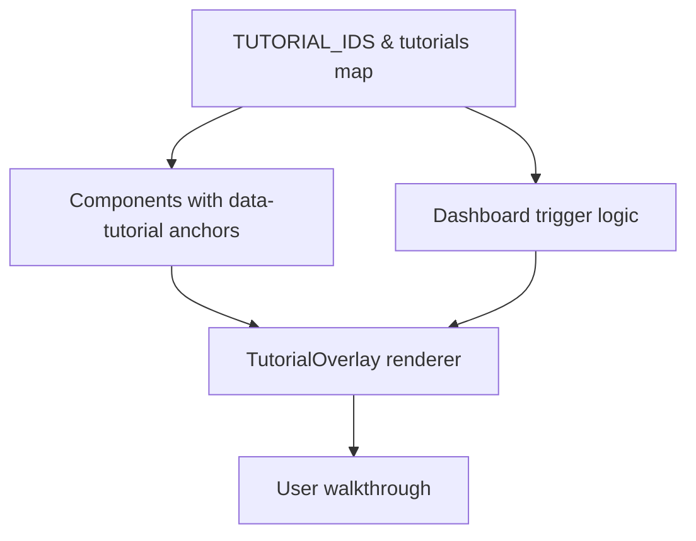

## Tutorial System Refactor Plan

### Scope

- Align tutorial definitions to actual `data-tutorial` anchors for Quiz, Rubric, Lesson, Kindergarten, Multigrade, Cross-Curricular.
- Remove dashboard overlay steps that point at quiz/rubric/lesson tab selectors.
- Add Visual Studio tutorials (Worksheet Generator, Image Studio) with anchors and IDs.
- Keep existing working tutorials (Analytics, Welcome Guide, Resource Manager, Curriculum Tracker) intact.

### Findings (mismatches & gaps)

- Quiz: component anchors use `quiz-generator-*` (see [frontend/src/components/QuizGenerator.tsx:886](../frontend/src/components/QuizGenerator.tsx#L886)), but tutorial uses `quiz-*` (see [frontend/src/data/tutorialSteps.ts:556](../frontend/src/data/tutorialSteps.ts#L556)). Missing anchors for difficulty/preview/export; grade/subject/count/topic anchors differ.
- Rubric: component anchors use `rubric-generator-*` (see [frontend/src/components/RubricGenerator.tsx:975](../frontend/src/components/RubricGenerator.tsx#L975)), tutorial uses `rubric-*` (see [frontend/src/data/tutorialSteps.ts:630](../frontend/src/data/tutorialSteps.ts#L630)). No export anchor in UI.
- Lesson Planner: component anchors use `lesson-planner-*` (see [frontend/src/components/LessonPlanner.tsx:967](../frontend/src/components/LessonPlanner.tsx#L967)), tutorial uses `lesson-*` (see [frontend/src/data/tutorialSteps.ts:266](../frontend/src/data/tutorialSteps.ts#L266)). Assessment/differentiation/export steps lack anchors.
- Kindergarten Planner: component anchors use `kinder-planner-*` (see [frontend/src/components/KindergartenPlanner.tsx:1022](../frontend/src/components/KindergartenPlanner.tsx#L1022)), tutorial uses `kinder-*` (see [frontend/src/data/tutorialSteps.ts:337](../frontend/src/data/tutorialSteps.ts#L337)). Resources step missing anchor.
- Multigrade Planner: component anchors use `multigrade-planner-*` (see [frontend/src/components/MultigradePlanner.tsx:880](../frontend/src/components/MultigradePlanner.tsx#L880)), tutorial uses `multigrade-*` (see [frontend/src/data/tutorialSteps.ts:408](../frontend/src/data/tutorialSteps.ts#L408)). Anchors exist for subject/grades/theme/resources/grouping/common-activities/differentiation/generate; tutorial names differ.
- Cross-Curricular Planner: component anchors use `cross-curricular-planner-*` (see [frontend/src/components/CrossCurricularPlanner.tsx:1074](../frontend/src/components/CrossCurricularPlanner.tsx#L1074)), tutorial uses `cross-*` (see [frontend/src/data/tutorialSteps.ts:482](../frontend/src/data/tutorialSteps.ts#L482)). No export anchor in UI.
- Dashboard TutorialOverlay still references tab selectors `tool-quiz` and `tool-rubric` (see [frontend/src/components/TutorialOverlay.tsx:679](../frontend/src/components/TutorialOverlay.tsx#L679)); these should be removed.
- Visual Studio tools lack tutorials and anchors: WorksheetGenerator has no `data-tutorial` markers (see [frontend/src/components/WorksheetGenerator.tsx:1](../frontend/src/components/WorksheetGenerator.tsx#L1)); ImageStudio has no `data-tutorial` markers (see [frontend/src/components/ImageStudio.tsx:18](../frontend/src/components/ImageStudio.tsx#L18)). TUTORIAL_IDS lacks entries for both (see [frontend/src/data/tutorialSteps.ts:4](../frontend/src/data/tutorialSteps.ts#L4)).

### Spotlight reliability (cutout fails / screen just darkens)

- Cause: `highlightRect` is null when `document.querySelector(step.target)` returns no element or a zero-sized element; the mask renders without a cutout and the overlay darkens the whole screen (see logic in [frontend/src/components/TutorialOverlay.tsx:45](../frontend/src/components/TutorialOverlay.tsx#L45) and mask at [frontend/src/components/TutorialOverlay.tsx:366](../frontend/src/components/TutorialOverlay.tsx#L366)).
- Missing resilience: no retries for late-rendered targets; no fallback spotlight; no warning when target is missing; scroll-to-window fallback not present (only scroll-parent logic).
- Fix plan (to be implemented in Code mode):
  - Add target resolution retries (e.g., 50/150/300ms) after step change to catch late renders.
  - If still missing or zero-sized, set `highlightRect` to a small centered rect and show a tooltip warning (“element not found; scroll if needed”).
  - Guard mask dimensions (no negatives) and keep padding configurable; ensure tooltip clamping after fallback.
  - Add window-level scroll-into-view fallback when scroll parent not found.

### Proposed new/updated Tutorial IDs

- Add `WORKSHEET_GENERATOR` and `IMAGE_STUDIO` to `TUTORIAL_IDS` in [frontend/src/data/tutorialSteps.ts:4](../frontend/src/data/tutorialSteps.ts#L4).

### Anchor alignment and step updates

- Quiz Generator
  - Use existing anchors: welcome, subject, grade, question-count, topic (learning outcomes), question-types, cognitive-levels, generate, history/preview section if desired.
  - Remove unused difficulty/preview/export steps unless anchors are added later.
- Rubric Generator
  - Use anchors: welcome, assignment, criteria, descriptors, levels, points, generate.
  - Drop export step unless UI gets an anchor.
- Lesson Planner (standard)
  - Use anchors: welcome, basic-info, duration, objectives, activities, materials, generate.
  - Remove assessment/differentiation/export steps (no anchors).
- Kindergarten Planner
  - Use anchors: welcome, theme, learning-areas, centers, circle-time, play-activities, assessment, generate.
  - Drop resources step unless an anchor is added.
- Multigrade Planner
  - Use anchors: welcome, subject, grades, theme, common-activities, differentiation, grouping, resources, generate (match `multigrade-planner-*`).
- Cross-Curricular Planner
  - Use anchors: welcome, grade, theme, subjects, connections, objectives, activities, assessment, generate (match `cross-curricular-planner-*`).

### Visual Studio tutorials (new)

- Worksheet Generator (add anchors, then steps):
  - Anchors to add: `worksheet-generator-welcome`, `worksheet-generator-subject`, `...-grade`, `...-strand`, `...-topic`, `...-question-count`, `...-question-type`, `...-template`, `...-include-images`, `...-image-style`, `...-generate`, `...-view-toggle`, `...-history`, `...-export` (or save), `...-image-prompt` (if using image generation), `...-image-generate`.
  - Steps to cover: configure basics, select template, optional images, generate, view student/teacher modes, save/export/history, open curriculum link.
- Image Studio (add anchors, then steps):
  - Anchors to add: `image-studio-tab-toggle`, `image-studio-prompt`, `image-studio-negative-prompt`, `image-studio-dimensions`, `image-studio-batch`, `image-studio-generate`, `image-studio-result-card`, `image-studio-save`, `image-studio-editor-upload`, `image-studio-brush`, `image-studio-mask`, `image-studio-remove`, `image-studio-undo`, `image-studio-save-edited`.
  - Steps to cover: switch Generator/Editor, craft prompts, generate batch, download/save, upload image, mask & remove objects, undo/redo, save to resources.

### TutorialOverlay cleanup

- Remove steps referencing `[data-tutorial="tool-quiz"]` and `[data-tutorial="tool-rubric"]` from [frontend/src/components/TutorialOverlay.tsx:679](../frontend/src/components/TutorialOverlay.tsx#L679).

### Wiring

- Map new IDs in `tutorials` record and `getTutorialById` usage; ensure dashboard tutorial triggers include new IDs where applicable (e.g., when auto-showing by tool type) in [frontend/src/data/tutorialSteps.ts:33](../frontend/src/data/tutorialSteps.ts#L33) and [frontend/src/components/Dashboard.tsx:2010](../frontend/src/components/Dashboard.tsx#L2010).

### Implementation checklist

- [ ] Update `TUTORIAL_IDS` and `tutorials` definitions to aligned anchors for quiz/rubric/lesson/kinder/multigrade/cross-curricular.
- [ ] Remove selector-related steps from TutorialOverlay (quiz/rubric tabs).
- [ ] Add Visual Studio anchors (WorksheetGenerator, ImageStudio) and define tutorial steps/IDs.
- [ ] Wire new IDs in dashboard/tutorial start logic.
- [ ] QA each tutorial to ensure steps appear on matching elements; adjust positions.

### Per-tool action list (what to change where)

- Quiz Generator
  - File: [frontend/src/data/tutorialSteps.ts](../frontend/src/data/tutorialSteps.ts#L556) — update steps to use `quiz-generator-*` anchors from [frontend/src/components/QuizGenerator.tsx:886](../frontend/src/components/QuizGenerator.tsx#L886). Remove legacy `quiz-*` selectors. Keep: welcome, subject, grade, question-count, topic (learning outcomes), question-types, cognitive-levels, generate. Optional: add history/preview target if anchor added.
- Rubric Generator
  - File: [frontend/src/data/tutorialSteps.ts](../frontend/src/data/tutorialSteps.ts#L630) — switch to `rubric-generator-*` anchors from [frontend/src/components/RubricGenerator.tsx:975](../frontend/src/components/RubricGenerator.tsx#L975). Keep: welcome, assignment, criteria, descriptors, levels, points, generate. Drop export unless UI adds anchor.
- Lesson Planner (standard)
  - File: [frontend/src/data/tutorialSteps.ts](../frontend/src/data/tutorialSteps.ts#L266) — switch to `lesson-planner-*` anchors from [frontend/src/components/LessonPlanner.tsx:967](../frontend/src/components/LessonPlanner.tsx#L967). Keep: welcome, basic-info, duration, objectives, activities, materials, generate. Remove assessment/differentiation/export steps (no anchors).
- Kindergarten Planner
  - File: [frontend/src/data/tutorialSteps.ts](../frontend/src/data/tutorialSteps.ts#L337) — switch to `kinder-planner-*` anchors from [frontend/src/components/KindergartenPlanner.tsx:1022](../frontend/src/components/KindergartenPlanner.tsx#L1022). Keep: welcome, theme, learning-areas, centers, circle-time, play-activities, assessment, generate. Drop resources unless anchor added.
- Multigrade Planner
  - File: [frontend/src/data/tutorialSteps.ts](../frontend/src/data/tutorialSteps.ts#L408) — switch to `multigrade-planner-*` anchors from [frontend/src/components/MultigradePlanner.tsx:880](../frontend/src/components/MultigradePlanner.tsx#L880). Use: welcome, subject, grades, theme, common-activities, differentiation, grouping, resources, generate. Align names to anchors.
- Cross-Curricular Planner
  - File: [frontend/src/data/tutorialSteps.ts](../frontend/src/data/tutorialSteps.ts#L482) — switch to `cross-curricular-planner-*` anchors from [frontend/src/components/CrossCurricularPlanner.tsx:1074](../frontend/src/components/CrossCurricularPlanner.tsx#L1074). Use: welcome, grade, theme, subjects, connections, objectives, activities, assessment, generate. Drop export unless anchor added.
- Dashboard overlay cleanup
  - File: [frontend/src/components/TutorialOverlay.tsx:679](../frontend/src/components/TutorialOverlay.tsx#L679) — remove steps that target `[data-tutorial="tool-quiz"]` and `[data-tutorial="tool-rubric"]` (broken selectors once tabs are hidden/disabled). Keep core tab-management steps.
- Visual Studio: Worksheet Generator
  - File: [frontend/src/components/WorksheetGenerator.tsx](../frontend/src/components/WorksheetGenerator.tsx#L1) — add stable `data-tutorial` anchors on form sections: welcome container, subject select, grade select, strand select, topic input, question-count, question-type, template picker, include-images toggle, image-style select, image-prompt (if used), image-generate, generate worksheet button, view toggle (student/teacher), history panel toggle, export/save buttons, curriculum card link.
  - File: [frontend/src/data/tutorialSteps.ts](../frontend/src/data/tutorialSteps.ts#L4) — add `WORKSHEET_GENERATOR` ID and steps pointing to these anchors with sensible positions (mostly right/top on form, center/top for results).
- Visual Studio: Image Studio
  - File: [frontend/src/components/ImageStudio.tsx](../frontend/src/components/ImageStudio.tsx#L18) — add `data-tutorial` anchors: tab toggle (generator/editor), prompt, negative-prompt, dimensions (width/height), steps/batch selectors, generate button, result card, save/download, editor upload, brush size, mask canvas, remove button, undo/redo, save edited. Ensure containers have visible height when tutorial runs.
  - File: [frontend/src/data/tutorialSteps.ts](../frontend/src/data/tutorialSteps.ts#L4) — add `IMAGE_STUDIO` ID and steps with positions: form fields (right/top), canvas (center/top), toolbar (right), save buttons (left/top).
- Wiring
  - File: [frontend/src/data/tutorialSteps.ts](../frontend/src/data/tutorialSteps.ts#L33) — include new IDs in `tutorials` map.
  - File: [frontend/src/components/Dashboard.tsx:2010](../frontend/src/components/Dashboard.tsx#L2010) — map tool types `worksheet-generator` and `image-studio` to new tutorial IDs for auto-start/lookup if used.

### Spotlight / cutout guidance (to prevent dark-only overlay)

- Ensure every tutorial step targets a visible, rendered element with non-zero size; avoid targeting elements hidden behind conditionals or zero-height containers. Prefer wrapping stable divs with `data-tutorial` instead of buttons that may unmount.
- Avoid targeting elements inside closed accordions; either auto-expand before tutorial or place anchors on always-visible containers.
- After adding anchors, keep mask padding to ~8px around the rect; ensure no negative dimensions. If target may render late, add retry logic (50/150/300ms) before giving up; fallback to centered 1x1 rect plus tooltip warning.
- For scrollable panels, ensure the scroll parent has `overflow-y-auto` and height; allow scroll-into-view within parent and fallback to window scroll.
- For interactive steps (click/advance): mirror the Analytics Dashboard pattern—set `interactive: true`, `waitForAction: 'click'`, and optionally `actionHint`. Provide a solid backdrop element of sufficient size for the cutout. Avoid auto-advancing until the action fires. If using `clickTarget`, ensure that element persists and is reachable in the DOM when the step starts.

### Mermaid (tutorial data flow)

